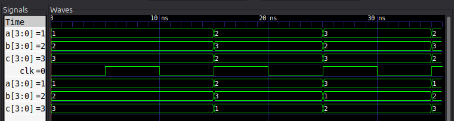

# Ejercicio 1 — Análisis: Blocking vs. Non-blocking (SystemVerilog)

## Enunciado

Nos piden predecir los valores de `a`, `b` y `c` tras el primer y el segundo
`posedge clk`, sabiendo que antes del primer flanco vale `a=1`, `b=2`, `c=3`.
El reloj tiene período de 10 ns con 50% de duty cycle. Los dos casos posibles
son:

* **Caso A (blocking):**

  ```systemverilog
  always_ff @(posedge clk) begin
      a = b; b = c; c = a;
  end
  ```

* **Caso B (non-blocking):**

  ```systemverilog
  always_ff @(posedge clk) begin
      a <= b; b <= c; c <= a;
  end
  ```

La pregunta es: **¿cuál de los dos implementa un rotador circular real?**

---

## Cómo lo resolvemos

Para entender qué pasa en cada flanco, comparamos los dos estilos de asignación que ofrece Verilog. La diferencia no está en qué se asigna, sino en **cuándo** se lee y se escribe cada variable dentro del bloque.

### Caso A — blocking (`=`): el orden de escritura importa

Con el bloqueante (`=`), cada sentencia **se ejecuta y termina en el momento**: apenas asignamos `a`, el siguiente `=` ya lee el valor nuevo de `a`.

Partimos de `(a,b,c) = (1,2,3)` y en el flanco hacemos:

1. `a = b` → `a` pasa a valer **2**
2. `b = c` → `b` pasa a valer **3**
3. `c = a` → como `a` ya vale 2, `c` pasa a valer **2**

El resultado es que tenemos dos registros con el mismo valor (`a` y `c` valen 2) y el `3` original desaparece. O sea: **no rota**. Además, para este caso, este estilo mezcla el orden de escritura con la lógica de los registros, lo que en hardware de verdad genera trazas y comportamientos no deterministas. No es lo que queremos.

### Caso B — non-blocking (`<=`)

Con `<=`, el comportamiento cambia por completo: **todas** las expresiones de la derecha se evalúan con los valores viejos del flanco, y **recién al final** se actualizan las variables de la izquierda. Entonces, para `(1,2,3)`:

1. `a <= b` → se "anota" que a valdrá 2
2. `b <= c` → se "anota" que b valdrá 3
3. `c <= a` → como todavía se usa el `a` viejo, c valdrá **1**

Todos los valores del flanco anterior se recogen al mismo tiempo y se asignan juntos. Eso produce el movimiento circular que esperábamos: cada registro toma el valor del anterior sin que el orden de las líneas influencie el resultado.

## Comparación

Recopilamos los valores de `a`, `b`, `c` en `t = 0 ns`, `10 ns` y `20 ns` (ambos casos partiendo de `1,2,3` en reset):

Tiempo  |  Caso A (blocking)     |  Caso B (non-blocking)
--------+------------------------+-------------------------
    0ns |  a=1 b=2 c=3           |  a=1 b=2 c=3
   10ns |  a=2 b=3 c=2           |  a=2 b=3 c=1
   20ns |  a=3 b=2 c=3           |  a=3 b=1 c=2
--------+------------------------+-------------------------

> Si seguimos un ciclo más, el caso B continúa rotando: `(1,2,3) → (2,3,1) → (3,1,2) → (1,2,3) → ...`. Es exactamente un rotador.
> 
> En el caso A, en cambio, cada bloque `=` **sobreescribe** en el momento: el mismo flanco escribe `a` (lo pone en 2) y luego `c` también (en 2), y el 3 se pierde. Si seguimos dos ciclos, alternamos entre `(2,3,2)` y `(3,2,3)` sin llegar nunca a una rotación limpia.

## Preguntas clave del análisis

Acá intentamos responder a las tres dudas que plantea el enunciado:

### 1. ¿Es legal usar `always_ff` en ambos? ¿Por qué?

Sí, **legal es legal**: los dos códigos compilan y simulan sin error dentro de un `always_ff`. Lo que ocurre es que **utilidad no es la misma**. `always_ff` es el bloque secuencial de SystemVerilog que le indica a la herramienta que ahí va a haber registros disparados por el reloj. La pregunta de fondo es qué hardware genera cada estilo:

* Con `<=` (caso B) tenemos el patrón correcto: cada variable que se asigna en el bloque responde a un flip-flop real, y la semántica de "tomar el valor viejo" es exactamente la que tiene un registro.
* Con `=` (caso A) rompemos esa abstracción. `always_ff` con `=` sigue siendo sintácticamente válido, pero el resultado sintetizado puede no coincidir con el que esperamos en simulación (el orden de las sentencias pasa a importar). En la práctica, escribir `=` en un bloque secuencial es considerado un **anti-patrón**.

### 2. ¿Cuál es el estilo correcto?

El estilo correcto y de buena práctica en RTL es:

* **`<=` (non-blocking)** para lógica secuencial (`always_ff`), porque respeta la naturaleza de los registros: todos capturan el valor previo en el mismo instante.
* **`=` (blocking)** para lógica combinacional (`always_comb`), donde el orden y el cálculo directo sí nos importan.

Esta separación es una de las convenciones básicas del diseño RTL.

### 3. ¿Cuál es el rotador circular?

El **Caso B (non-blocking)**. Solo con `<=` conseguimos que los valores roten de verdad, porque todos los registros leen en simultáneo su estado anterior y escriben su nuevo valor. La secuencia queda `1→2→3→1→2→3…`, que es la definición exacta de un rotador circular y corresponde a lo que dice el enunciado: `(1,2,3) → (2,3,1) → (3,1,2) → …`.

## Verificación (bonus)

Para no quedarnos con la teoría, verificamos todo con una simulación en IcarusVerilog de un módulo `rotator` que tiene un puerto `style` para poder elegir entre los dos estilos. Nuestro testbench:

* instancia el módulo dos veces (una con `style=0`, otra con `style=1`);
* aplica el reset y los dos flancos del enunciado;
* compara `a`, `b`, `c` contra los valores esperados y reporta **PASS/FAIL**.

La salida confirma nuestra predicción; la tabla que imprime coincide con la que armamos arriba: el caso B rota, el caso A no. El VCD obtenido es el siguiente:

<div style="text-align: center; width: 720px; margin: 0 auto;">



</div>

> **Nota de SystemVerilog:** el código usa `always_ff`, `logic` y
> `parameter int W`. Para compilar con iverilog se usa `-g2012`, porque
> son constructos propios de SystemVerilog.

## Archivos

| Archivo        | Contenido                                              |
|----------------|--------------------------------------------------------|
| `rotator.sv`   | Módulo SystemVerilog con reset y estilo (`=`/`<=`)     |
| `tb_rotator.sv`| Autocheck contra la tabla esperada (PASS/FAIL)         |
| `run.sh`       | Compila + simula con iverilog/vvp (`-g2012`)           |