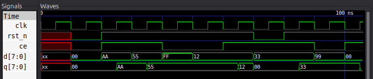

# Ejercicio 2 — Registro 8-bit con Clock Enable (SystemVerilog)

## Enunciado

Nos piden implementar un registro de 8 bits con estas características:

* Entrada de datos `d[7:0]` y salida `q[7:0]`.
* Reset asíncrono activo-bajo (`rst_n`).
* **Clock enable** `ce` (activo-alto).
* Si `ce = 0`, el registro **mantiene** el valor anterior (no escribe).
* Sobre el reset, `q` se pone en `8'h00`.

El testbench debe aplicar **10 vectores** cubriendo: reset, escritura con `ce = 1`, hold con `ce = 0`, y cambio de valor mientras `ce = 0` (que **no debe** actualizar la salida).

---

## Cómo lo resolvemos

El módulo es un registro real, así que la clave está en **qué orden** consultamos cada condición dentro del `always_ff`. La pista del enunciado no es casual: el reset se chequea **primero** y después el `ce`.

### El patrón canónico

```systemverilog
always_ff @(posedge clk or negedge rst_n) begin
    if (!rst_n) begin
        q <= '0;               // reset asíncrono: q = 0
    end else if (ce) begin
        q <= d;                // ce = 1: cargar el dato
    end
    // ce = 0: no hay asignación -> el FF conserva el valor
end
```

Razonamos los tres casos que puede ver el registro:

1. **`rst_n = 0`:** la rama del reset manda primero, sin que importe qué valgan `ce` o `d`. Como la lista de sensibilidad contiene `negedge rst_n`, el reset es *asíncrono*: reacciona a la caída del pin y no espera al reloj. Y como está *primero* en el `if`, tiene **prioridad** sobre el write.
2. **`rst_n = 1` y `ce = 1`:** el registro captura `q <= d`.
3. **`rst_n = 1` y `ce = 0`:** no se ejecuta ninguna asignación. Para un flip-flop, "no escribir" es exactamente **conservar el estado previo**: es el comportamiento *hold* que buscamos.

Los tres casos que contempla el `always_ff` cubren por completo la especificación. La lista de sensibilidad `posedge clk or negedge rst_n` es la firma clásica de un reset asíncrono: le decimos a la herramienta que el bloque se despierta tanto por el reloj como por la caída del reset.

### ¿Por qué no hay un `else` para `ce = 0`?

Se puede notar que omitimos el caso `ce = 0` explícito. Es una decisión intencional de estilo:

* Si escribiéramos `q <= q`, el resultado lógico sería el mismo, pero le pedimos a la herramienta que haga una reescritura redundante del registro.
* Al no asignar nada, la síntesis igualmente infiere el flip-flop (por semántica), pero el código comunica con más claridad que estamos ante un *hold* gestionado por `ce`.

Las dos variantes son válidas; elegimos la más limpia por legibilidad.

### Parametrización

Para seguir la consigna de "patrón `reg_ce` parametrizable", el ancho se expone con `parameter int W = 8`. Así el mismo módulo sirve para registros de cualquier cantidad de bits sin tocar la lógica.

## El testbench

El testbench es autocontenido: genera el clock, instala el DUT, aplica los estímulos y compara contra una tabla de valores esperados. La convención de tiempo es simple:

* Los estímulos se presentan justo después del `negedge`, para que queden estables durante toda la fase baja del reloj antes del `posedge`.
* La salida se muestrea justo después del `posedge` (`#1`), para no competir con la propagación interna del registro.

Los 10 vectores que cubren el pedido son:

| # | rst_n | ce | d   | q esperado | Qué verifica                    |
|---|-------|----|-----|-----------|---------------------------------|
| 1 |  0    | 0  | 00  | 00        | Reset asíncrono activo-bajo     |
| 2 |  1    | 1  | AA  | AA        | Write con `ce = 1`               |
| 3 |  1    | 1  | 55  | 55        | Write: sobreescribe              |
| 4 |  1    | 0  | FF  | 55        | Hold: `ce = 0` ignora el dato    |
| 5 |  1    | 0  | 12  | 55        | Hold: cambia `d`, `q` se mantiene |
| 6 |  1    | 1  | 12  | 12        | Write: vuelve a cargar           |
| 7 |  0    | 1  | 33  | 00      | Reset sobre write: manda el reset |
| 8 |  1    | 1  | 33  | 33        | Write: sale del reset            |
| 9 |  1    | 0  | 99  | 33        | Hold: se conserva el valor previo |
| 10|  1    | 1  | 00  | 00        | Write a cero                      |

Los vectores 4, 5 y 9 ejercitan el *hold*: presentamos un dato distinto pero con `ce = 0`, y el registro debe ignorarlo. El vector 7 confirma que el reset manda aunque `ce = 1`.

## Verificación

Ejecutamos:

```bash
./run.sh
```

Ese script compila con `iverilog -g2012` (necesario para los constructos SystemVerilog como `always_ff` y `logic`) y corre `vvp`. La salida reporta PASS/FAIL por vector y un cierre general:

```
   # | rst    ce    d    | resultado
-----+-------------------+----------
   1 | rst=0  ce=0  d=00 | q=00  OK 
   2 | rst=1  ce=1  d=aa | q=aa  OK 
   3 | rst=1  ce=1  d=55 | q=55  OK 
   4 | rst=1  ce=0  d=ff | q=55  OK 
   5 | rst=1  ce=0  d=12 | q=55  OK 
   6 | rst=1  ce=1  d=12 | q=12  OK 
   7 | rst=0  ce=1  d=33 | q=00  OK 
   8 | rst=1  ce=1  d=33 | q=33  OK 
   9 | rst=1  ce=0  d=99 | q=33  OK 
  10 | rst=1  ce=1  d=00 | q=00  OK 
-----+-------------------+----------

RESULTADO: PASS  (10/10 vectores OK)
```

Los 10 vectores pasan: el registro respeta el reset, escribe cuando `ce = 1` y se queda en *hold* cuando `ce = 0`, tal como pide el enunciado.

El VCD obtenido es el siguiente:

<div style="text-align: center; width: 720px; margin: 0 auto;">



</div>

## Archivos

| Archivo          | Contenido                                             |
|------------------|-------------------------------------------------------|
| `reg_ce.sv`      | Módulo paramétrico con reset asíncrono y clock enable |
| `tb_reg_ce.sv`   | Testbench con 10 vectores y autocheck PASS/FAIL       |
| `run.sh`         | Compila y simula con iverilog/vvp (`-g2012`)          |