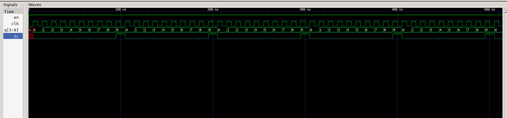

# Ejercicio Nro 3 - Contador BCD 0-9 con Enable

## Enunciado

Se requiere realizar un contador BCD (0-9) que incrementa su valor cuando la señal `en` se encuentra en alto. El contador debe tener rollover (que cuando el contador esta en 9 el siguiente valor que toma es 0) y debe colocar en alto la señal `tc` cuando sucede esto. Se utiliza la señal síncrona `reset` que coloca la salida del contador en 0.

El `testbench` debe verificar el rollover y el comportamiento de la señal `tc` comparando contra un golden model en el propio testbench.

## Resolución

Para resolver el ejercicio se crearon dos archivos, el primero de ellos con la descripción del hardware y el segundo para la descripción del testbench:

### 1.
El archivo `bcd_counter.v` contiene la descripción del hardware para cumplir con lo solicitado por el ejercicio. El contador se describe mediante un bloque síncrono que funciona con un flanco ascendente (activado por *posedge clk*) del reloj, donde el `reset` sincrono coloca la salida en 0. Cuando `en` está en alto, el contador se incrementa en cada ciclo, salvo que se encuentre en 9, caso en el que vuelve a 0 (rollover). La señal `tc` se describe de forma combinacional porque debe permanecer en alto únicamente durante el ciclo en que el contador vale 9 y `en` está en alto.

### 2.
El archivo `tb_bcd_counter.v` contiene la descripción del testbench. Se genera la señal de reloj y se instancia el DUT junto con un golden model, que realiza de forma independiente el comportamiento esperado del contador descripta de forma simplificada. Durante la simulación se comparan en cada ciclo los valores de salida del DUT contra los del golden model, registrando la cantidad de aciertos (PASS), errores (FAIL) y rollovers detectados. Al finalizar la simulación se muestra por pantalla un resumen con estos resultados. En este archivo además se genera el archivo VCD para realizar la visualización del comportamiento de las señales.

## Resultados

Luego de realizar la simulación sobre 100 ciclos de reloj, el resultado de la comparación mostrado por línea de comando fue el siguiente:

```bash
Se realiza la simulación sobre 100 ciclos de reloj
Resumen: 100 PASS, 0 FAIL, 10 Rollovers de, 100 ciclos
```

El gráfico obtenido tras ejecutar `tb_bcd_counter.vcd` es el siguiente:

