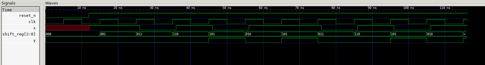

# EJERCICIO 4 - FSM Detector de Secuencia "101"

## ENUNCIADO

* Implementar una FSM Moore que detecte la secuencia binaria
  `"1 0 1"`   en una entrada serial x. Cuando se detecta el patrón:
  1) La salida y se pone en 1 durante UN ciclo de clock.

  2) El detector se solapa: el último "1" de una detección puede ser
     el primer "1" de la siguiente.

## RESOLUCIÓN

### Diagrama de estados:

Estado | x=0 -> | x=1 -> | y
-------|--------|--------|---
S00    | S00    | S01    | 0
S01    | S10    | S01    | 0
S10    | S00    | S11    | 0
S11    | S10    | S01    | 1

RESET (cualquier estado) --> S00   (Asincrono)

### Modulo FSM: detector_101.v
 
 Para la resolución del ejercicio se implemento un módulo (*"detector_101"*) que contiene 4 puertos,*clk*,*reset_n*, *x*, *y*. En el archivo se define un nuevo tipo de dato lógico de dos bits enumerado, este es utilizado para realizar los cuatro estados de la máquina de estados codificados de forma binaria (S_00,S_01,S_10,S_11). Se generan dos señales de este tipo, la primera de ellas (*"state"*) para describir el estado en el que se encuentra y la segunda para definir el proximo estado ("*next*") de acuerdo a las condiciones, esto utilizando una sentencia case. Puesto que la maquina es una maquina de estados de Moore la salida es en función del estado en el que se encuentra.


### Testbench: tb_detector_101.v

 Para realizar la verificación de las secuencias *esperadas vs obtenidas* es necesario realizar un golden model que realice de una forma mas sencilla el funcionamiento de la maquina de estados, para ello fue necesario realizar un shiftreg que hacia la izquierda ingresando los valores que toma x de forma secuencial, cuando el registro almacena la secuencia *"101"* incrementa el contador de esperados. Luego se ejecuta la evaluacion del DUT del modulo.


## RESULTADOS

### RESULTADOS OBTENIDOS EN EL DISPLAY:
    ```bash
    Salida = 0, estado = 1
    Salida = 0, estado = 1
    Salida = 0, estado = 2
    Salida = 1, estado = 3
    Salida = 0, estado = 2
    Salida = 1, estado = 3
    Salida = 0, estado = 1
    Salida = 0, estado = 2
    Salida = 1, estado = 3
    Salida = 0, estado = 2
    Salida = 1, estado = 3
    Secuencias encontradas= 4, Secuencias esperadas= 4
    ```

### SEÑALES OBTENIDAS:

