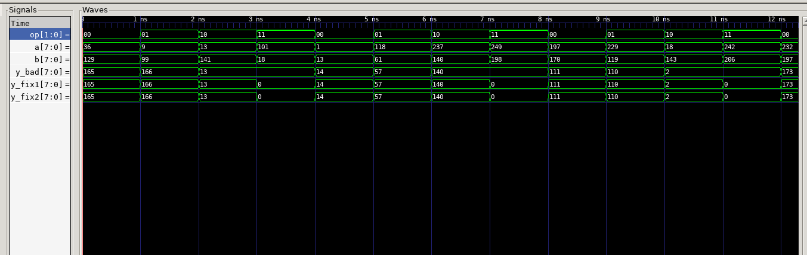

# EJERCICIO NRO 6
## ENUNCIADO
Inspeccionar el código propuesto por el ejercicio y realizar:

#### a.  Identificar el bug y por qué se infiere latch
#### b. Proponer DOS fixes (default vs pre-asignación)
#### c. Implementar ambas versiones y verificar equivalencia
#### d. Inspeccionar con yosys que no quedan latches

## RESOLUCIÓN

* Para resolver el ejercicio fueron creados tres modulos distintos de una ALU:

### Modulo 1: alu_bad

* Este modulo contiene el código propuesto por el ejercicio, en él se describe el funcionamiento de una *ALU*, se selecciona la operación a realizar utilizando una señal de 2 bits (op). La salida del modulo (y) es en función de los operandos de entrada (a,b) y de la operación seleccionada. 

* Este código contiene un bug explicado con mayor detalle en [este reporte](report.md). A modo de resumen, el sintetizador infiere un Latch a causa de la no especificación de la salida para todos los casos posibles de *op*.

### Modulo 2: alu_fix1

* Este módulo tiene una estructura similar a la *"alu_bad"* con la salvedad que se corrige el bug de este módulo asignando un caso default. Este caso default funciona para asignarle salida 0 (y=0) para cualquier caso no determinado en la sentencia case.

### Modulo 3: alu_fix2

* La estructura del módulo es similar a la de los otros dos módulos, la diferencia principal es que se toma otra medida para corregir el bug de *"alu_bad"¨*, se realiza una preasignacion de la salida y, es decir, se le asigna un valor antes de ingresar a la sentencia case.

### Testbench: tb_alu

* En el testbench se realiza la simulación de los 3 módulos utilizando señales aleatorias de entrada. Esta compuesto principalmente por una task que realiza la comparación de las salidas de los tres módulos y realiza un recuento de las veces que valen lo mismo y de las veces que no. El estimulo es generado por una sentencia for que realiza 64 veces las 4 operaciones de la alu generando señales de entradas aleatorias. 

## RESULTADOS


### Resultados en display:
```bash
OP= 11 ,y_bad= 4 , y_default= 0 , y_preasignacion= 0 
OP= 11 ,y_bad= -64 , y_default= 0 , y_preasignacion= 0 
OP= 11 ,y_bad= 6 , y_default= 0 , y_preasignacion= 0 
OP= 11 ,y_bad= 32 , y_default= 0 , y_preasignacion= 0 
OP= 11 ,y_bad= -96 , y_default= 0 , y_preasignacion= 0 
OP= 11 ,y_bad= -87 , y_default= 0 , y_preasignacion= 0 
PASS= 197, FAIL= 59
```

* Se registraron 59 fallos, todos correspondientes a op=2'b11 (la combinacion
no cubierta en alu_bad). Si bien teoricamente deberian ser 64 fallos (los 64
vectores con op=11), los 5 casos restantes no se registraron como fallo
porque el latch retuvo, en esos casos puntuales, el valor 0 calculado por
la operacion anterior -- coincidiendo por azar con el valor fijo (0) que
producen alu_fix1 y alu_fix2.

### RESULTADOS SIMULACION DE SEÑALES


