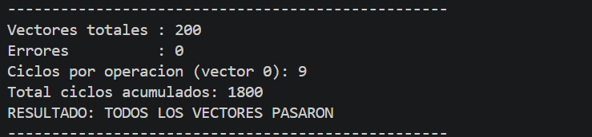
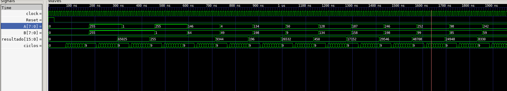
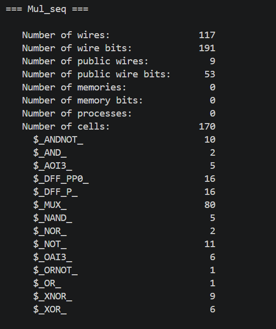

# EJERCICIO NRO 4 - Multiplicador Shift-and-Add (secuencial)

## ENUNCIADO 

    Implementar un multiplicador unsigned de 8×8 bits que produzca el resultado
    completo en 8 ciclos de reloj.

    Componentes:

    • Adder de 8 bits

    • Registro acumulador de 16 bits

    • Shifter (a la izquierda) en cada ciclo

    • FSM de control con estados

        IDLE → COMPUTE → DONE

    Validar con un testbench que compare

    contra a*b en el host.

## RESOLUCIÓN

 * **ACLARACION:** 
    Si bien la consigna pide realizar un shifteo hacia la izquierda, lo que implicaría el corrimiento de los bits del multiplicando A, se optó por un corrimiento hacia la derecha del acumulador. De esta forma se obtiene el mismo resultado aritmetico final sin necesidad de ampliar el ancho del sumador por cada shifteo.

 * Para resolver el ejercicio fue necesario dividir el funcionamiento en dos módulos:

### Modulo de Multiplicación - Mul_seq:
 
 * Este módulo es el que se encarga de realizar la lógica de multiplicación, está compuesto por un adder de 8 bits, un acumulador de 16 bits y un shifter hacia la derecha. El modo de funcionamiento es la siguiente:
    + Inicialemnte se carga en los bits menos significativos al operando B (multiplicador).
    + Se analiza el bit 0 del acumulador para determinar si se debe hacer la suma parcial o no.
    + En el caso en que el bit 0 del acumulador (sería el de B) es 1, se suman los bits mas significativos del acumulador con los bits del operando A. Si es 0 no se suma nada.
    + En el siguiente clock una señal proveniente de la lógica de control indica que es necesario hacer un shifteo hacia la derecha y se ejecuta.
    + Se repite esto hasta que todos los bits correspondientes a B estén fuera del acumulador
* El módulo recibe señales bandera de la lógica de control (start,shift_end y end_cy), con esto determina que acciones tomar en el próximo ciclo de clk.

### Módulo de Control - Contro_FSM:

* Este módulo es el encargado de emitir las señales bandera que utiliza el módulo de multiplicación para determinar que actividad hacer. Está pensado como una máquina de estados finita (FSM) de 3 estados (IDLE-COMPUTE-DONE). Se mantiene en el primer estado hasta que haya un señal de inicio de multiplicación, luego se inicializa en 0 un contador y se pasa al siguiente estado. En el siguiente estado se coloca una señal de enable para que el contador comience a contar, este estado es utilizado para indicar que se va a multiplicar, coloca la señal Star = 1 en el valor 0 del contador y en los proximos 8 valores coloca shift_en = 1 para que se realice un shifteo en la proxima señal de reloj. El último valor del contador genera el cambio de estado a DONE, allí se coloca end_cy = 1 y se pasa los valores de resultado a la salida, en el proximo clock será posible realizar una nueva multiplicación.

## RESULTADOS

* Se evaluaron los módulos bajo 200 casos aleatorios y 5 casos extremos. Los resultados fueron los esperados. Sin errores:

* Luego se realizo el conteo de cantidad de ciclos por operación, el resultado es de 9 ciclos (esperabamos 8), el problema está en que necesitamos de un ciclo para colocar los valores iniciales (inicializar acumulador), si quitamos este ciclo que es necesitamos el conteo de ciclos daría lo esperado, los 8 ciclos propios de la operación:

## ANALISIS AREA VS THROUGHPUT

* Como se analizó anteriormente, está implementación de multiplicación debe esperar 9 ciclos para obtener el resultado (propio de su funcionamiento secuencial). Por tanto, su throughput está dado por: Th = 1/Cyc -> Th = 1/(9*10ns) -> Th = 11.11 x 10^6 operaciones/segundo. 

* Para analizar el área implementado por el circuito utilizamos la herramienta YOSYS que nos da la cantidad de compuertas y componentes que infiere el sintetizador:

### **Conclusión:** 

* El trade-off entre área y throughput queda claro con estos números: el multiplicador secuencial ocupa muy poca área (170 celdas, según YOSYS) a costa de necesitar 9 ciclos de reloj para completar cada operación, lo que limita su throughput a 11.11 x 10^6 operaciones/segundo . En otras palabras, el diseño reutiliza el mismo sumador de 8 bits en 8 pasadas sucesivas, logrando un área mínima con el costo de la velocidad de cómputo, existe una pasada más que es de carga.

