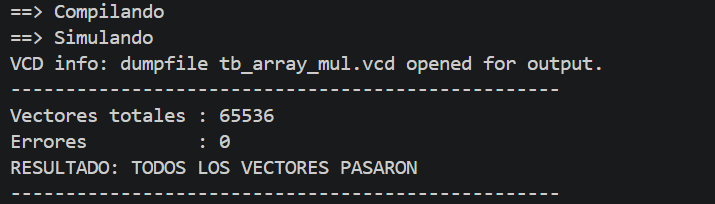
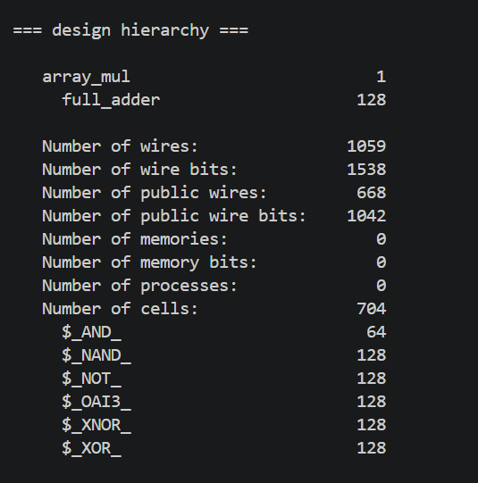
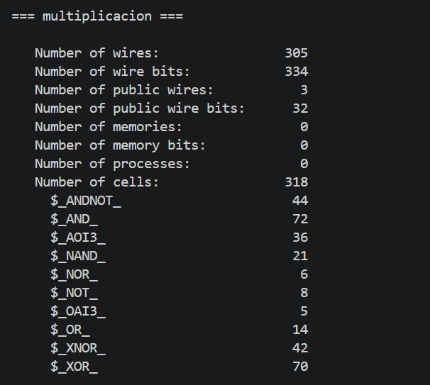

# EJERCICIO NUMERO 5 - Array Multiplier 8×8 (combinacional)

## ENUNCIADO

    Implementar un multiplicador 8×8 unsigned combinacional basado en una matriz de full adders.

    Estructura:

    • Generación de PP con AND-gates

    • 7 filas de full adders para reducir

    • Una fila final de RCA para el CPA

    Medir el delay y comparar contra:

    ① el multiplicador secuencial del Ej. 4

    ② un multiplicador en RTL con "*"

## RESOLUCIÓN

 * Para resolver el ejercicio se recurrió a la implementación de dos módulos:

    1) Full_adder: Debido a que la consigna solicita una descripción estructural de cada una de las celdas como un full-adder, fue necesario instanciar este módulo en cada para cada columna en cada fila. Está conformado por 3 entradas y 2 salidas, A, B y C_in (entradas) y S,C_out (salidas).

    2) array_mul: Este módulo desarrolla la multiplicación de forma combinacional. Se desarrollan en él dos formas de funcionamiento distinto (behavioral y descripción estructural). En un primer intento de realizar el ejercicio se desarrollo una descripción del modulo de forma behavioral, es decir, utilizando en lugar de módulos *full-adders* el operando "+" para realizar la suma, esto fue rápidamente descartado porque al realizar el analisis con Yosys la sintesis no realizaba los FA que el ejercicio solicitaba. Sin embargo, los resultados esperados fueron correctos. La segunda descripción que contiene es una mas detallada en su estructura, se solicita en cada celda un FA para sumar con el vector de carry, el vector de resultado anterior y el producto parcial actual. La estructura general es, sin embargo, la misma para ambas descripciones. En una primera parte se obtienen los productos parciales recorriendo los bits del multiplicador (B) y haciendo una operación "AND" con el multiplicado (A). La segunda parte realiza la suma de los productos parciales, en el caso de la descripcion estructural detallada con CSA para las filas intermedias y RCA con la última fila. Luego se escribe el resultado en P. 

## RESULTADOS

* Resultados obtenidos en display con 256^2 vectores:

* Full-Adders y celdas generadas:

* Cantidad de celdas generadas con el operando de multiplicación "*":

## ANÁLISIS DE DELAY TEÓRICO

* Al ser un circuito puramente combinacional, el delay del array multiplier no lo medimos en ciclos de reloj sino en niveles lógicos atravesados en el camino crítico, desde que cambian las entradas *(A, B)* hasta que el resultado *(P)* se estabiliza.

* La estructura se compone de dos etapas con comportamiento distinto:

    + **7 filas de CSA:** cada full adder de una fila combina bits de la fila anterior sin propagar el carry horizontalmente dentro de la misma fila (el carry se guarda para la fila siguiente, corrido una posición, esto en un nuevo vector *C*). Por lo tanto, cada una de las 7 filas agrega un único nivel de full adder al camino crítico, sin importar el ancho de 16 bits, ya que todas las columnas se calculan en paralelo:

        *Delay_CSA = 7 × t_FA* -> t_FA = tiempo teórico de un Full-adder

    + **1 fila final de RCA (CPA):** a diferencia de las filas CSA, acá el carry sí se propaga bit a bit de la posición 0 a la 15 (ripple real), por lo que el delay crece linealmente con el ancho:

        *Delay_CPA = 16 × t_FA*

* Sumando, el delay teórico total del array multiplier es:

        *Delay_total = (7 + 16) × t_FA = 23 × t_FA*

## COMPARACIÓN CON EL MULTIPLICADOR (SECUENCIAL) Y OPERADOR "*" 

* Para el multiplicador secuencial del Ejercicio 4 observamos que tiene un delay por operación de:

        Delay_secuencial = 9 ciclos × T_clock = 9 × 10ns = 90ns 

* El array multiplier, al resolver la multiplicación en una única pasada combinacional, tiene un delay de 23 × t_FA. Si suponemos un valor de referencia de t_FA = 1ns, esto da 23ns. 

* Para hacer un contraste correcto es necesario observar el bajo costo en area del multiplicador secuencial comparado al de array multiplier, su área esta compuesta por 170 celdas (observando imagen de Yosys) mientras que la del array multiplier es de 704 celdas. 

* Al sintetizar un tercer módulo equivalente descripto únicamente con el operador "***", se observa que el sintetizador logra una implementación que ocupa menos área, solo 318 celdas. El sintetizador es libre de optimizar el ancho de cada suma según la cantidad real de bits necesarios en cada columna, evitando el hardware redundante que genera nuestra descripción estructural. Esta implementación es tambien puramente combinacional. 

### **Conclusión:**

* El array multiplier resuelve la multiplicación en una única pasada, con un delay teórico de aproximadamente 23 × t_FA, considerablemente menor que los 90ns que requiere el multiplicador secuencial. Sin embargo, esta ganancia de velocidad se obtiene al costo de un área mucho mayor (704 celdas contra 170). El trade-off es el mismo que se observó en el análisis de área vs throughput del Ejercicio 4, ahora confirmado desde el lado del delay, menos ciclos y mayor velocidad implican necesariamente más hardware combinacional.