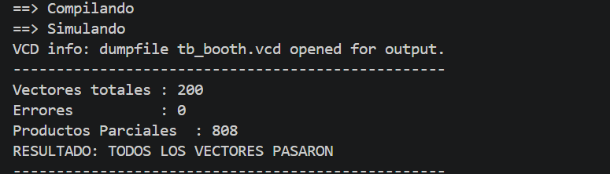

# EJERCICIO NRO 6 - Booth radix-2 y reducción Wallace/Dadda

## ENUNCIADO
Implementar Booth radix-2 para un multiplicador signado 8×8 bits.

Para cada par (b[i], b[i-1]) generar:

• 0 si "00" o "11"

• +A si "01"

• −A si "10"

Sumar los PPs con sign-extension adecuada.

*Avanzado (opcional): comparar la reducción Wallace vs Dadda en cantidad de HAs/FAs (a nivel conceptual o RTL con CSAs explícitos).*

## RESOLUCIÓN

* Para la resolución de la primera parte del ejercicio (Booth-Radix2) utilizamos el módulo implementado con el mismo algoritmo del Trabajo Práctico Nro. 3. Este módulo fue pensado para ser parametrizable, lo único que modificamos fueron los anchos de los operandos (consecuentemente el del resultado). 

### Módulo boot_r2:

* Es el encargado de ejecutar la lógica de la multiplicación. Su modo de funcionamiento es el siguiente: 
    + Se concatena al operando B (multiplicador) un 0 en su LSB.
    + Se recorre el operando B desde el LSB hasta el MSB tomando el bit y su anterior, esto para tomar la decisión. [B(i),B(i-1)].
    + La operación a realizar es de acuerdo a la siguiente tabla:
        Tabla de accion:

        | bᵢ bᵢ₋₁ | Acción        |
        |---------|---------------|
        | 0 0     | No hacer nada |
        | 0 1     | Sumar A       |
        | 1 0     | Restar A      |
        | 1 1     | No hacer nada |

* Esto permite reducir la cantidad de productos parciales a realizar.

### Sign-extension de los productos parciales 
 *Caso del ejercicio este, diferencia con el módulo booth-radix2 original*

 Como los operandos están en complemento a 2, cada producto parcial (+A o −A) puede tener valor negativo, y su peso depende de la posición *i* en la que se genera (queda corrido *i−1* lugares). Para que la suma de todos los PPs dé el resultado correcto, cada uno debe extenderse por signo al ancho completo del producto (`width_P = width_A + width_B`) **antes** de aplicarle el corrimiento — si el corrimiento se hiciera sobre el ancho original de A (`width_A` bits), los bits más significativos que el shift necesita se perderían, corrompiendo el resultado. Por eso, tanto A como su complemento a 2 (−A = Ā+1) se calculan y extienden a `width_P` bits antes de correrlos y acumularlos.

## RESULTADOS

* Al realizar el TestBench fue necesario agregar un contador de PPs. El modo de implementación es similar al modo en que se implemento el recorrido del operando B en el módulo *booth_r2* incluyendo un contador de PPs.

* Los resultados fueron correctos, no existe ningun error al compararlo con los esperados:

## DISCUSIÓN: ¿Cúando booth no ayuda?

* La idea de booth-radix2 es reducir la cantidad de productos parciales recodificando el multiplicador (en nuestro caso B) en grupos de bits: [bi,b(i-1)]. Agrupa bits para ahorrarse cadenas largas de 1s. En base a los valore que tomen esta recodificación realiza el producto parcial.

* El caso extremo de booth sería en un numero cuya codificación binaria está compuesta por 1s y 0s alternados. Por ejemplo: (10101010) = 170. Este caso es un caso extremo de productos parciales que no generaría ninguna ganancia frente a un multiplicador sin recodificar.

* Para anchos de operando muy chicos, el hardware adicional que requiere la recodificación puede no justificarse frente al ahorro de PPs, que en esos anchos ya es mínimo.

