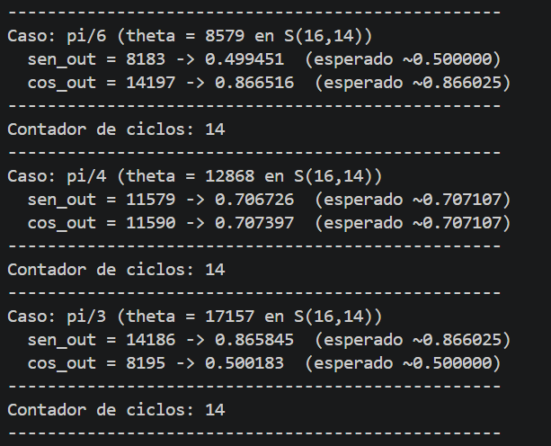
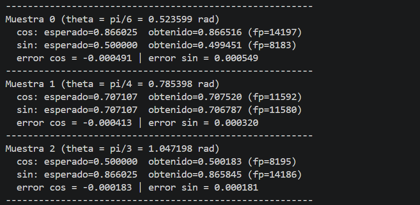
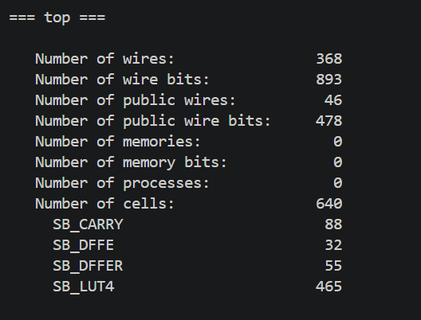
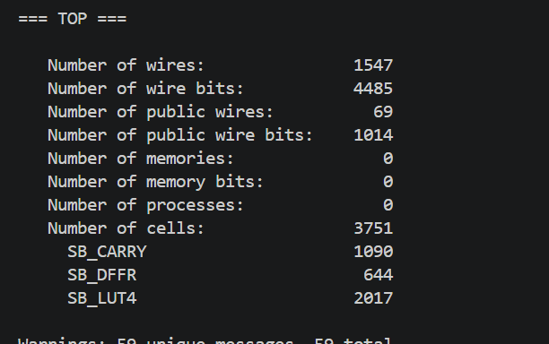

# Ejercicio 2 — CORDIC: Comparación Folded vs Pipeline (Unfolded)

## Enunciado

**Tomar el CORDIC del ejercicio 1 y construir una versión pipeline (unfolded).**
Comparar área, f_max y latencia entre ambas implementaciones usando una herramienta de síntesis (Vivado, Yosys o similar).

**Datos:**
- Mismo formato S(16,14), N = 14 iteraciones
- Tecnología: FPGA Artix-7 o ASIC 45/130nm
- Constraint inicial: 100 MHz
- Reporte LUTs/FFs o área µm²

**Entregables:**
- (a) RTL pipeline (14 etapas)
- (b) Tabla comparativa Área / F_max / latencia
- (c) Cálculo de throughput
- (d) Conclusión: ¿cuándo usar cuál?

> Nota del enunciado: reportar throughput = samples/segundo, no solo latencia.

---

## (a) Criterios de diseño del RTL pipeline

### Eliminación de control secuencial
A diferencia del folded (FSM de tres estados IDLE→ITER→DONE + contador de iteración para reutilizar un único datapath en el tiempo), el pipeline no requiere FSM ni contador de iteración. Cada una de las 14 iteraciones tiene su propia instancia física de hardware, fija y dedicada exclusivamente a esa iteración. El reloj sigue siendo necesario en todo el diseño (sigue siendo lógica síncrona); lo que desaparece es la lógica de control que decidía "en qué iteración estoy".

### Estructura: `generate` con 14 instancias parametrizadas
Se instancia 14 veces un módulo de una sola etapa CORDIC, cada instancia con su propio índice de etapa como **parámetro fijo en tiempo de síntesis** (no como señal variable de runtime, a diferencia del folded). Esto es lo que permite que el compilador trate cada etapa como una unidad de hardware con comportamiento invariante y optimizable de forma independiente.

### Consecuencias del índice de etapa como constante de síntesis
Al ser el índice de cada etapa una constante fija (no una señal), varias operaciones que en el folded requerían hardware genérico y reconfigurable en runtime pasan a resolverse en tiempo de síntesis.


### Registro entre etapas
Cada etapa cierra con lógica secuencial que registra X, Y, Z antes de pasarlos a la etapa siguiente. Este registro es lo que separa temporalmente una etapa de la siguiente y permite que convivan múltiples muestras distintas de forma simultánea, cada una en su propia etapa — es la base estructural del throughput de 1 muestra por ciclo en régimen estable.


---

## (b) Tabla comparativa: Área / F_max / Latencia

> Nota: los valores de F_max se presentan de forma teórica/relativa según la fórmula de latencia en ciclos, dado que la obtención de F_max real mediante síntesis completa (place & route) para el diseño folded no pudo completarse por una limitación de la toolchain de síntesis disponible. El área y la latencia sí corresponden a valores obtenidos.

| Métrica | Folded (Ejercicio 1) | Pipeline (Ejercicio 2) |
|---|---|---|
| LUTs | *465* | *2017* |
| Flip-Flops | *87* | *644* |
| Latencia (ciclos) | 14 | 14 |
| Latencia (tiempo) | 14 × T_clk | 14 × T_clk |
| F_max | 100 MHz (constraint, no verificado por limitación de herramienta) | 55.07 MHz (medido con icetime, HX8K) |
| Throughput | 1 muestra / (14 × T_clk) | 1 muestra / T_clk (en régimen) |

---

## (c) Cálculo de throughput

**Folded:** el datapath se reutiliza secuencialmente para las 14 iteraciones de una misma muestra antes de poder aceptar la siguiente. Por lo tanto:

```
throughput_folded = 1 / (14 × T_clk)
```

**Pipeline:** una vez lleno (después de la latencia inicial de 14 ciclos), el diseño acepta una muestra nueva en cada flanco de reloj, ya que cada etapa es una unidad de hardware independiente:

```
throughput_pipeline = 1 / T_clk = f_clk
```

La mejora de throughput del pipeline sobre el folded es de aproximadamente **14x**, para una misma frecuencia de reloj de referencia.

---

## (d) Conclusión: ¿cuándo usar cuál?

Es posible notar que la principal diferencia entre ambas implementaciones está en el área y en el throughput; la latencia es igual para ambas (14 ciclos), ya que ambas arquitecturas atraviesan la misma cantidad de etapas de cálculo, solo que organizadas de forma distinta en el tiempo (folded) o en el espacio (pipeline).

Si se requiere una implementación de mayor velocidad y no existen limitaciones estrictas de área disponible, conviene una implementación pipeline: el throughput mejora significativamente (hasta ~14x) a costa de una mayor cantidad de LUTs/FFs.
Si se requiere una implementación que ocupe poca área (o pocas LUTs) y no es necesaria tanta velocidad porque el sistema está sobrado de tiempo (el throughput requerido es bajo), conviene una versión folded: se sacrifica velocidad de procesamiento a cambio de un uso mínimo de recursos.

Lo ideal, en un caso intermedio, sería una implementación híbrida entre ambos extremos: por ejemplo, 4 etapas pipelineadas, donde cada una resuelva internamente varias iteraciones de forma folded (algo similar a una arquitectura de "pipeline parcialmente desenrollado"). Esto permitiría ajustar el compromiso área-throughput de forma más fina, en lugar de optar únicamente por los dos extremos (totalmente folded o totalmente pipeline), acercándose al punto óptimo según las restricciones específicas de área y velocidad de cada aplicación.

---

## Resultados de terminal

### Resultados - Folded



### Resultados — Pipeline



### Síntesis — Folded



### Síntesis — Pipeline


