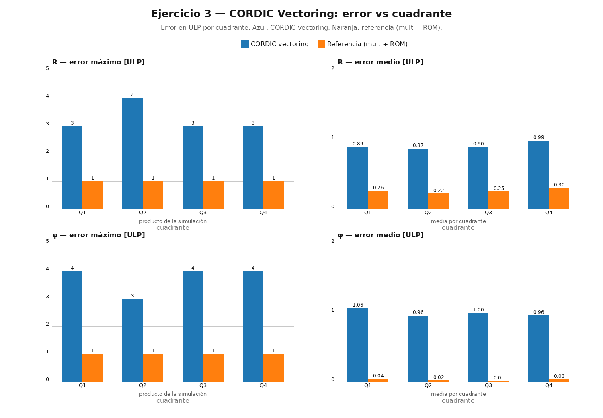

# Ejercicio 3 — CORDIC Vectoring: magnitud y ángulo (`R` y `φ`)

## Resumen

Implementamos un **CORDIC en modo *vectoring*** que, dado un vector `(x, y)`, calcula

```
R   = sqrt(x^2 + y^2)      (magnitud)
phi = atan(y/x)            (ángulo, en los 4 cuadrantes)
```

y lo comparamos contra una **implementación de referencia "directa"** que resuelve lo mismo por el camino clásico: un multiplicador (para los cuadrados) y **dos ROMs grandes** (para la raíz y el arco tangente).

> La conclusión de la comparación es la que sugiere el enunciado: el CORDIC logra **1 ULP típico (peor caso 4 ULP)** con **cero bits de ROM** y sin multiplicador real (solo sumas, desplazamientos y una tablita de 16 valores). La referencia alcanza **1 ULP** pero a costa de **2 Mbit de ROM**. Si el presupuesto de área es ajustado, el CORDIC es el camino; si queremos el máximo de precisión y hay ROM/BRAM de sobra, la referencia gana por poco.

## Interpretación de la consigna (formatos de datos)

Tomamos dos decisiones que conviene aclarar de entrada, porque la consigna no las especifica:

- **`φ` se expresa en "unidades de π"** (valor = ángulo/π). El formato `S(16,14)` cubre `[-2, 2)`, que **no alcanza para ±π** (~3.14). Normalizando a π, el círculo completo `(-π, π]` mapea a `(-1, 1]`. La corrección de cuadrante pasa a ser sumar/restar `1.0` exacto (= π), y la tabla de `atan(2⁻ⁱ)` queda en esas mismas unidades.
- **`R` es exacto solo para entradas con `R < 1`**: con `x, y ∈ S(16,15) = [-1, 1)`, `R = sqrt(x²+y²)` puede llegar a ~1.414, que no entra en `S(16,15)`. Saturamos la salida a `0x7FFF` (R = 1.0) y los vectores de test usan `R ∈ [0.2, 0.95]`.

  > **Qué implica en la práctica.** Es una restricción de **rango del formato**, no un defecto del CORDIC. Cuando `R > 1` la salida se "aplana" a `0x7FFF`, así que dos vectores distintos con `R > 1` producen el mismo valor (se pierde la distinción) y el error salta de ~1 ULP a miles de ULP — la saturación no es lineal. El CORDIC internamente usa `X, Y ∈ S(18,15)` (3 bits de parte entera), por lo que el algoritmo no se desborda durante las iteraciones; lo único que se recorta es la salida `R` al leer `X_final`. La referencia directa tiene la misma limitación.
  >
  > **Cómo se soluciona.** En este entregable lo acotamos con el testbench (`R ∈ [0.2, 0.95]`), lo cual es pragmático pero *no* una solución de diseño. Para un hardware real, las alternativas son: (a) **re-escalar las entradas** (ej. `x >> 1`) a costa de 1 bit de precisión; (b) **ensanchar la salida** a `S(17,15)`/`S(18,15)` para que cubra hasta ~1.414, lo más limpio porque elimina la saturación y el datapath interno ya tiene 18 bits; o (c) añadir un **flag de overflow** que avise cuando hubo clip.

Internamente el CORDIC trabaja con `X, Y ∈ S(18,15)` (bits de guarda) y `z ∈ S(16,14)`.

## (a) RTL del CORDIC vectoring — `cordic_vect.sv` + `rom_atan.sv`

### La idea del modo *vectoring*

En *vectoring* el objetivo es rotar el vector hasta que `y → 0`. En cada iteración rotamos en el sentido que **acerca `y` a cero**:

```
d = signo que lleva y a 0:  y >= 0  ->  d = -1   (girar en sentido horario)
                            y <  0  ->  d = +1   (girar en sentido antihorario)

X' = X - d·Y·2^-i
Y' = Y + d·X·2^-i
Z' = Z - d·atan(2^-i)
```

Cuando `y ≈ 0`, el vector quedó sobre el eje `+x`, `X` vale `R/K` y `Z` acumuló el ángulo rotado, que es `φ`. Con `X0 = K·x`, `Y0 = K·y` el `X` final es `R` directo (la `K` se compensa al inicio, no al final).

### Decisiones de diseño del RTL

- **Pre-escalado por `K = 0.60725`**: lo hacemos como **multiplicación por constante** (`X·K`), que el sintetizador convierte en sumas y desplazamientos — el CORDIC no usa multiplicador real.
- **Pre-rotación de 180° si `x < 0`** (la sugerencia del enunciado): si `x < 0`, usamos `(-x, -y)`. Con `x` positivo, el ángulo del vector queda en `[-π/2, π/2]` y el acumulador `z` nunca sale del rango de convergencia (~±0.555π). La magnitud no cambia.
- **Bits de guarda en `X, Y ∈ S(18,15)`**: el datapath interno usa 18 bits (3 de parte entera) en vez de 16. Da margen para las sumas/restas de cada iteración y el crecimiento transitorio del proceso antes de truncar a `R`; sin ellos las sumas intermedias desbordarían 16 bits y darían resultados erróneos. Los 2 bits extra se descartan al final (se truncan a 16 para `R`).
- **Corrección de cuadrante** sobre el `z` final, en unidades de π:

```
x >= 0           ->  φ = z
x < 0, y >= 0    ->  φ = z + 1.0     (cuadrante II)
x < 0, y <  0    ->  φ = z - 1.0     (cuadrante III)
```

- **Desplazamientos con redondeo a *nearest*** (`round(v·2^-i)`): los sumamos antes de desplazar. Es lo que mantiene el error del CORDIC en ~1 ULP típico; truncar a secas costaba 1-2 ULP extra.
- **Tabla `atan(2⁻ⁱ)`** de 16 entradas en `S(16,14)` (unidades de π): `i=0 → 0.25`, y de ahí en escala. La generamos con `gen_roms.py` (`atan_lut.vh`).
- **FSM implícita** (contador `i` + `busy` + `done` registrado): latencia **16 ciclos** desde `start`, `done` pulso de 1 ciclo con el resultado válido.

## (b) Referencia directa con multiplicador + ROMs — `ref_direct.sv`

El camino "directo" que se compara contra el CORDIC:

1. **Un único multiplicador 16×16→32 reutilizado** calcula `x²` y `y²` en dos ciclos (mux por estado). Sumamos → `s = x² + y²`.
2. **ROM de raíz cuadrada de 64K×16 = 1 Mbit** indexada por `s[30:15]` (los 16 bits más significativos) → `R`. Con esa indexación el error de la ROM queda ~0.5 ULP para `R ≥ 0.2` (el rango de test).
3. **Divisor restoring combinacional** (16 etapas) calcula `q = min(|x|,|y|)/max(|x|,|y|) ∈ [0,1]` en `U(16,16)`.
4. **ROM de atan de 64K×16 = 1 Mbit** indexada por `q` → `atan(q)/π`. Si `|y| > |x|` se complementa a `π/2` y se reconstruye el cuadrante por los signos de `x` e `y`.

FSM de 2 estados (`SQ1 → SQ2`): latencia **2 ciclos** desde `start`. El área de la referencia está dominada por las ROMs (2 Mbit), no por la lógica.

## (c) Comparación área + precisión

### Área

| Arquitectura        | Celdas lógicas | ROM (bits) |
|---------------------|---------------:|-----------:|
| CORDIC vectoring    |          17293 |          0 |
| Referencia mult+ROM |          15779 |    2097152 |

> El CORDIC no tiene memoria: su tablita de 16 valores queda absorbida en la lógica combinacional. La referencia necesita 2 Mbit (2 × 64K × 16), que en un FPGA Artix-7 son ~64 BRAMs de 32 Kb. Si sumamos lógica + memoria, la **referencia domina claramente el área**. La lógica del CORDIC es algo mayor porque hace desplazamientos por `i` variable y el escalado por `K`; la referencia, en cambio, tiene el multiplicador y el divisor.

### Precisión (contra el valor en doble precisión, medido en ULP)

| Q | R CORDIC max/med | R ref max/med | φ CORDIC max/med | φ ref max/med |
|---|------------------|---------------|-------------------|---------------|
| I |     3 / 0.89     |    1 / 0.26   |      4 / 1.06     |   1 / 0.04    |
| II|     4 / 0.87     |    1 / 0.22   |      3 / 0.96     |   1 / 0.02    |
| III|    3 / 0.90     |    1 / 0.25   |      4 / 1.00     |   1 / 0.01    |
| IV|     3 / 0.99     |    1 / 0.30   |      4 / 0.96     |   1 / 0.03    |

> El CORDIC queda en **≤ 4 ULP** (peor caso, un vector con ángulo muy pronunciado) y **~1 ULP de media** en todos los cuadrantes. La referencia está en **1 ULP** (la ROM de 64K con el cociente de 16 bits deja el error en el piso de la cuantización). La **diferencia de precisión es mínima; la de área, enorme**.

## (d) Error vs cuadrante

Medimos el error por vector en los 4 cuadrantes (828 vectores: barrido angular + bordes + 200 aleatorios por cuadrante) y lo volcamos a `datos/errores.csv`. El gráfico `output_ej3.png` muestra el error en ULP por cuadrante para el CORDIC y la referencia, con la media de cada grupo:



**Conclusión:** el error es **uniforme en los 4 cuadrantes** — no aparece ninguna degradación en los cuadrantes II y III, lo que confirma que la pre-rotación de 180° más la corrección `±π` funcionan bien. El peor caso del CORDIC (4 ULP en `R` y `φ`) ocurre en vectores con ángulos cercanos a los ejes o muy pronunciados, donde se acumulan los redondeos del punto fijo.

## Verificación

- **Vectores de test**: los genera `gen_roms.py` (`datos/vectors.hex`, 828 vectores) con `R ∈ [0.2, 0.95]` cubriendo los cuadrantes I–IV, incluidos ejes y casos cercanos a ±90°.
- **Testbench self-checking** (`tb_cordic_vect.sv`): instancia el CORDIC y la referencia en paralelo con estímulo compartido y verifica
  1. protocolo (`done` pulso de 1 ciclo, latencia 16/2 ciclos),
  2. exactitud contra el valor "verdadero" en doble precisión (`$atan2`/`$sqrt`) en ULP,
  3. *cross-check* CORDIC vs referencia (redondean distinto, pero deben coincidir en pocos ULP).
- Reporta **PASS/FAIL** y escribe `datos/errores.csv`.
- **Yosys** verifica el área de ambas arquitecturas.
- **`analisis_error.py`** genera el gráfico y el resumen por cuadrante.

## Archivos

| Archivo | Rol |
|---------|-----|
| `cordic_vect.sv` | (a) datapath CORDIC vectoring *folded* (16 iteraciones en 16 ciclos) |
| `rom_atan.sv` | (a) tabla `atan(2⁻ⁱ)` en unidades de π (`include` de `atan_lut.vh`) |
| `ref_direct.sv` | (b) referencia directa: 1 multiplicador + ROM sqrt 64K + divisor restoring + ROM atan 64K |
| `gen_roms.py` | genera `atan_lut.vh` y los datos de `datos/` (`sqrt_rom.hex`, `atan2_rom.hex`, `vectors.hex`, `nvec.txt`) |
| `tb_cordic_vect.sv` | testbench self-checking (828 vectores, PASS/FAIL, `datos/errores.csv`) |
| `analisis_error.py` | (d) error vs cuadrante + `output_ej3.png` (numpy + PIL) |
| `run.sh` | automatiza todo: ROMs → compilación → simulación → Yosys → gráfico |
| `output_ej3.png` | gráfico del error vs cuadrante |
| `datos/` | datos generados: ROMs `.hex`, vectores `.txt`, `errores.csv`, `sim.out`, `tb_cordic_vect.vcd` |
