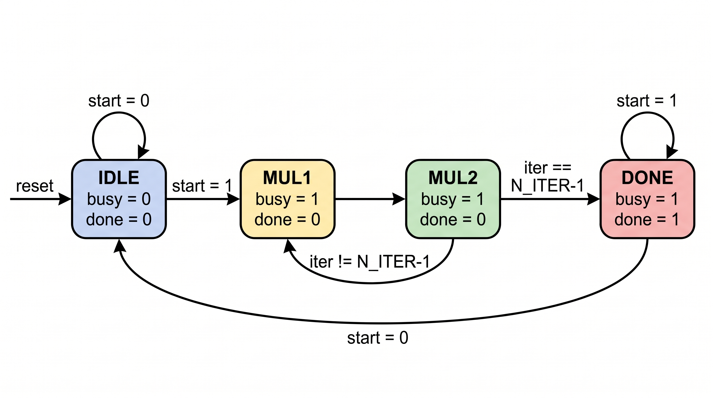
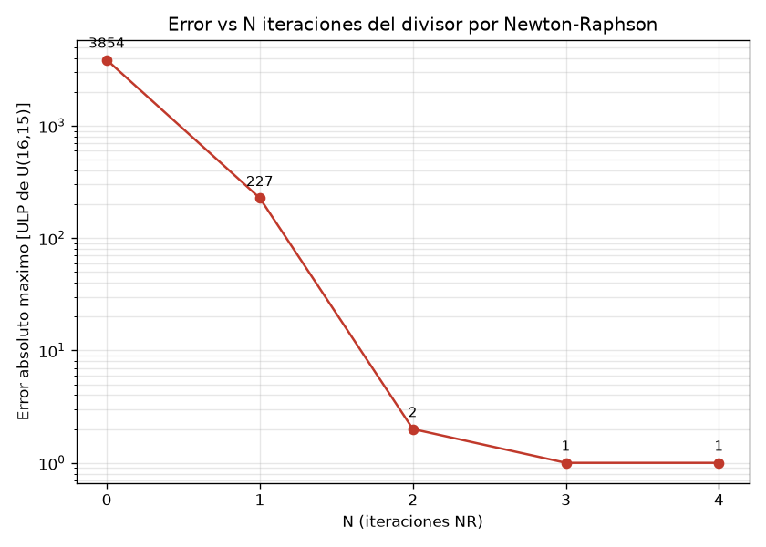

# Ejercicio 4 — Divisor por Newton-Raphson (`y = 1/a`)

## Resumen

Implementamos un divisor por el método de Newton-Raphson que calcula `y = 1/a` con 16 bits de precisión. El divisor trabaja sobre un `a` normalizado al rango `[0.5, 1.0)`, arranca con una semilla `y0` sacada de una **LUT chica de 8 entradas** y refina el resultado con **3–4 iteraciones NR** usando un único multiplicador `16×16 → 32` reutilizado (datapath *folded*) y una FSM de control con flag `done`.

> Con la semilla de la LUT y 3 iteraciones alcanzamos el piso del punto fijo: **1 ULP** de error sobre todo el rango de `a` (error relativo ~`3·10⁻⁵`). La cuarta iteración no mejora nada porque ya estamos en el límite de resolución de la salida.

## Formato de los datos

- **Entrada `a`**: `U(16,16)` — 16 bits sin signo, 16 fraccionarios. Normalizada a `[0.5, 1.0)`, el MSB siempre vale 1 y `a_q = a·2¹⁶ ∈ [0x8000, 0xFFFF]`.
- **Salida `y`**: `U(16,15)` — 16 bits sin signo con el MSB como bit entero (vale 1, porque `y ∈ (1, 2]`) y 15 bits fraccionarios.

> ⚠️ **Nota sobre la consigna.** El enunciado pide "formato `U(16,16)` en `y`", pero `y = 1/a` con `a ∈ [0.5, 1.0)` cae siempre en `(1, 2]`, que **no entra en `[0, 1)`**. Interpretamos el formato como "16 bits sin signo con la máxima resolución fraccionaria para el rango `(1, 2]`", que es `U(16,15)`: el MSB es el bit entero (siempre 1) y quedan 15 bits de fracción. Con `U(16,16)` sería imposible representar la salida.

El caso límite `a = 0.5` da `y = 2.0 = 0x10000`, que no cabe en 16 bits; lo saturamos a `0xFFFF` (error de 1 ULP).

## La iteración de Newton-Raphson

Para calcular el recíproco, la iteración NR es:

```
y_{n+1} = y_n · (2 − a·y_n)
```

La convergencia es **cuadrática**: cada iteración duplica aproximadamente la cantidad de bits correctos. Por eso una LUT "suficientemente buena" + 3 iteraciones llega al piso del punto fijo (la LUT aporta ~4 bits, y 3 iteraciones duplican 4 → 8 → 16, más que suficiente para 15 bits fraccionarios).

### Aritmética en punto fijo

Cada iteración usa el multiplicador dos veces:

1. `p1 = a · y_n` (producto `16×16 → 32`).
2. `t = 2 − round(p1[31:16])`, con `round()` a *nearest* (sumamos $2^15$ antes del shift).
3. `y_{n+1} = clamp(round((t · y_n) >> 15))`, también redondeando a *nearest* (sumamos $2^14$) y saturado a `0xFFFF`.

El redondeo a *nearest* en los dos pasos es lo que nos deja en 1 ULP: truncar el paso de `t` costaba 1 ULP extra (lo medimos en el análisis).

## Entregables

### (a) Generador de LUT — `gen_lut.py` → `lut_y0.vh`

La LUT cubre el rango normalizado con 8 índices:

```
index = (a >> 12) & 7
```

Como `a ≥ 0.5`, `a >> 12 ∈ [8, 15]` y el `& 7` lo lleva a `[0, 7]`; cada bin tiene ancho `1/16 = 0.0625`. Para cada bin guardamos `y0 = 1/a` evaluado en el **punto medio del bin**, cuantizado a `U(16,15)`:

  bin |    rango de a     |   a_mid  |    y0 (U16.15)     | y0 dec
|----|-------------|-----------|-----------|-----------|
  0   | [0.5000, +0.5312) |  0.5312  | 0xf0f1  (1.882355) | 61681
  1   | [0.5625, +0.5938) |  0.5938  | 0xd794  (1.684204) | 55188
  2   | [0.6250, +0.6562) |  0.6562  | 0xc30c  (1.523804) | 49932
  3   | [0.6875, +0.7188) |  0.7188  | 0xb216  (1.391296) | 45590
  4   | [0.7500, +0.7812) |  0.7812  | 0xa3d7  (1.279999) | 41943
  5   | [0.8125, +0.8438) |  0.8438  | 0x97b4  (1.185181) | 38836
  6   | [0.8750, +0.9062) |  0.9062  | 0x8d3e  (1.103455) | 36158
  7   | [0.9375, +0.9688) |  0.9688  | 0x8421  (1.032257) | 33825

El script también calcula y muestra el error inicial por bin (~5.9 % en el peor caso) y genera el header Verilog `lut_y0.vh` con la ROM por `case` que usa el RTL.

### (b) Datapath NR *folded* — `nr_div.sv`

El datapath reutiliza **un solo multiplicador** `16×16 → 32`, muxado por el estado de la FSM:

```
mul_x  = (state == MUL1) ? a_reg : t;
mul_out = mul_x · y_reg;
```

- En `MUL1` el multiplicador calcula `p1 = a_reg · y_reg`.
- En `MUL2` calcula `p2 = t · y_reg` (con `t` combinacional desde `p1_reg`), y de ahí `y_{n+1}`.

Además del multiplicador tenemos un restador (`t = 2 − p1[31:16]`), tres sumas de redondeo y la saturación, todo combinacional. El resultado queda registrado en `y_reg`, que a su vez realimenta el multiplicador.

### (c) FSM de control con flag `done`



| Estado actual | Condición | Acciones en el flanco | Siguiente estado |
|---|---|---|---|
| `IDLE` | `start=0` | (espera) | `IDLE` |
| `IDLE` | `start=1` | `a_reg<=a`, `y_reg<=y0`, `iter<=0` | `MUL1` |
| `MUL1` | siempre | `p1_reg<=a*y` | `MUL2` |
| `MUL2` | `iter==N_ITER-1` | `y_reg<=y_new` | `DONE` |
| `MUL2` | `iter!=N_ITER-1` | `y_reg<=y_new`, `iter<=iter+1` | `MUL1` |
| `DONE` | `start=0` | — | `IDLE` |
| `DONE` | `start=1` | (mantiene resultado) | `DONE` |

La FSM es `IDLE → (MUL1 → MUL2) × N_ITER → DONE`:

- `start`: arranca una división (el dato `a` debe estar válido en ese ciclo).
- `done`: pulso de un ciclo cuando el resultado queda listo (`y` válido).
- `busy`: indica datapath ocupado.
- `N_ITER` es un parámetro (default `4`).

**Latencia: `2·N_ITER + 1` ciclos** desde `start` hasta observar `done`: el resultado `y` queda válido en `2·N_ITER` ciclos y `done` lo avisa el ciclo siguiente. El *throughput* (sin pipelining) es de 1 división cada `2·N_ITER + 1` ciclos.

## Verificación

### Vectores dorados — `gen_vectors.py`

El testbench no calcula la referencia "a mano": `gen_vectors.py` genera `a.hex` + `y_exp_1..4.hex` (1008 vectores: 8 de borde + 1000 aleatorios) usando el **modelo golden** `gen_lut.nr_iterate`, que replica exactamente la aritmética del RTL (mismo multiplicador, mismo redondeo, misma saturación). De esta forma Python y el hardware "hablan el mismo punto fijo" y cualquier diferencia es un bug real.

### Testbench self-checking — `tb_nr_div.sv`

El testbench instancia **cuatro DUTs en paralelo** (`N_ITER = 1..4`) con estimulación compartida y verifica:

1. **Exactitud bit a bit** contra el golden de Python para cada `N_ITER`.
2. **Error real** contra `1/a` calculado en doble precisión, medido en ULP y relativo (la tabla del entregable (d) también sale de la simulación).
3. **Protocolo**: `done` pulsa un solo ciclo, `busy` cubre la operación y la latencia es `2·N_ITER + 1`.

### Análisis de error vs N — `analisis_error.py` (entregable d)

Barre la **totalidad** del rango (los 32768 valores de `[0.5, 1.0)`) y mide el error para `N = 0..4`:

|  N | bits y0  | max err [ULP] | max err rel  | mean err rel | bits correctos
|--|------------|----------------|--------------------|---------------|---------------|
  0 | solo LUT |         3854  |    5.881e-02 |    2.165e-02 |         4.09
  1 | NR x1    |          227  |    3.467e-03 |    6.501e-04 |         8.17
  2 | NR x2    |            2  |    3.803e-05 |    7.156e-06 |        14.68
  3 | NR x3    |            1  |    3.052e-05 |    4.140e-06 |        15.00
  4 | NR x4    |            1  |    3.052e-05 |    4.140e-06 |        15.00



> **Conclusión:** con la LUT de 8 entradas y **3 iteraciones** alcanzamos 1 ULP, que es el piso de precisión de `U(16,15)` (error ~`3·10⁻⁵ = 2⁻¹⁵`). La cuarta iteración no aporta nada en punto fijo. El gráfico queda en `output_ej4.png`.

## Archivos

| Archivo | Rol |
|---------|-----|
| `gen_lut.py` | (a) generador de la LUT `y0(a)` → `lut_y0.vh`; también el modelo golden de punto fijo |
| `lut_y0.vh` | ROM de la LUT (auto-generado, no editar) |
| `nr_div.sv` | (b) datapath NR folded + (c) FSM con `done` |
| `gen_vectors.py` | vectores dorados (`a.hex`, `y_exp_N.hex`) |
| `tb_nr_div.sv` | testbench self-checking (4 DUTs, `N_ITER = 1..4`) |
| `analisis_error.py` | (d) error vs N iteraciones + `output_ej4.png` |
| `run.sh` | automatización completa |
| `output_ej4.png` | gráfico del error vs N |