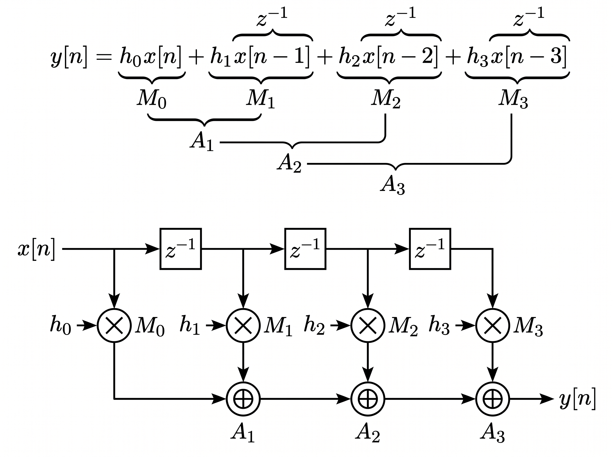

# Ejercicio 1 — DFG de un FIR de 4 coeficientes en forma directa

## Consigna

Dibujar el DFG (*Data Flow Graph*) de un filtro FIR de 4 coeficientes en forma directa, identificando explícitamente los **nodos** (operaciones), las **aristas** (flujo de datos) y los **registros** ($z^{-1}$).

## Resultado

## Resolución

### Punto de partida: la ecuación de diferencias

Un filtro FIR (*Finite Impulse Response*) es un sistema lineal e invariante en el tiempo cuya respuesta al impulso es finita y carece de realimentación (es no recursivo). Su salida es una suma ponderada directa de las muestras de entrada actuales y pasadas, siguiendo la ecuación de convolución discreta:

$$y[n] = \sum_{k=0}^{N} h_k \cdot x[n-k]$$

Para el caso de 4 coeficientes ($N = 3$), la ecuación queda:

$$y[n] = h_0x[n] + h_1x[n-1] + h_2x[n-2] + h_3x[n-3]$$

Donde:

* $x[n]$ es la entrada actual.
* $y[n]$ es la salida actual.
* $h_k$ son los coeficientes del filtro (que coinciden con la respuesta al impulso $h[k]$).
* $x[n-k]$ son los estados retenidos en la línea de retardo.

La **forma directa** es simplemente el mapeo topológico de esta ecuación: la entrada $x[n]$ recorre una línea de retardo en cascada (*tapped delay line*), de cada etapa se extrae un *tap* que se multiplica por su coeficiente $h_k$ en paralelo, y todos los productos convergen en una cadena de sumadores para producir $y[n]$.

### Construcción del grafo

Traduciendo la ecuación término a término, el DFG queda compuesto por:

| Elemento | Descripción | Representación | Ejemplos en nuestro circuito |
| --- | --- | --- | --- |
| **Nodos** | Operaciones de cómputo que transforman datos. Ej.: sumadores, multiplicadores, shifters. | Círculos con el símbolo de la operación. | Los 4 multiplicadores $M_0$, $M_1$, $M_2$, $M_3$ y los 3 sumadores $A_1$, $A_2$, $A_3$ |
| **Aristas** | Conexiones dirigidas que transportan datos y establecen dependencias. Determinan el orden en que se deben resolver las operaciones. | Flechas dirigidas que indican el sentido de flujo de señal. | El flujo desde $x[n]$ y de cada $z^{-1}$ hacia los multiplicadores, y de cada producto hacia la cadena de sumadores hasta $y[n]$ |
| **Registros ($z^{-1}$)** | Elementos de memoria sincrónica (flip-flops) que retienen el dato un ciclo de clock. Rompen caminos combinacionales y dividen etapas temporales. | Cuadrados o marcas con la notación de la transformada Z ($z^{-1}$, donde multiplicar por $z^{-1}$ equivale al retardo discreto $x[n-1]$). | Los 3 retardos en cascada sobre la línea de entrada, que producen $x[n-1]$, $x[n-2]$ y $x[n-3]$ |

El armado paso a paso es el siguiente:

1. **Plantear la ecuación y analizar los términos:** partimos de la ecuación de diferencias del FIR y desglosamos cada término: las muestras retardadas $x[n-k]$ indican cuántos registros $z^{-1}$ necesitamos, los coeficientes $h_k$ marcan las multiplicaciones, y la suma total define la cadena de sumadores.
2. **Línea de retardo:** la entrada $x[n]$ pasa por 3 registros $z^{-1}$ en cascada. En cada tap se obtienen las versiones retardadas $x[n-1]$, $x[n-2]$ y $x[n-3]$.
3. **Multiplicadores:** cada tap se multiplica por su coeficiente ($h_0 \dots h_3$) en los nodos $M_0 \dots M_3$. Estas 4 multiplicaciones ocurren **en paralelo**.
4. **Cadena de sumadores:** los productos se combinan de forma incremental: $A_1 = M_0 + M_1$, $A_2 = A_1 + M_2$ y $A_3 = A_2 + M_3$, cuya salida es $y[n]$.

> Como el FIR no tiene realimentación, el grafo resultante es **acíclico** (*feed-forward*), algo que será clave en los ejercicios siguientes de *scheduling* y *pipelining*.
