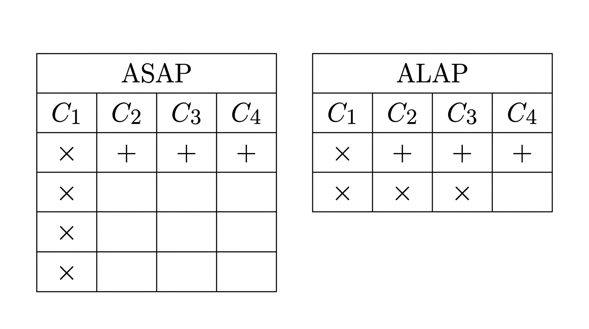

# Ejercicio 2 — Scheduling ASAP y ALAP sobre el FIR de 4 coeficientes

## Consigna

Asignar cada nodo del DFG a un ciclo de clock bajo **recursos ilimitados**, calculando la movilidad (*slack*) de cada operación mediante programación ASAP (*As Soon As Possible*) y ALAP (*As Late As Possible*).

## Punto de partida

Tomamos como base el DFG del FIR construido en el [Ejercicio 1](../ej1_DFG/README.md), compuesto por los 4 multiplicadores $M_0 \dots M_3$ y la cadena de sumadores $A_1, A_2, A_3$:

* $M_0 = x[n] \cdot h_0$, $\;M_1 = x[n-1] \cdot h_1$, $\;M_2 = x[n-2] \cdot h_2$, $\;M_3 = x[n-3] \cdot h_3$
* $A_1 = M_0 + M_1$, $\;A_2 = A_1 + M_2$, $\;A_3 = A_2 + M_3 = y[n]$

Adoptamos dos convenciones de trabajo:

* **Latencias unitarias:** cada operación (suma o multiplicación) tarda **1 ciclo de clock** en producir su resultado.
* **Recursos ilimitados:** si $K$ operaciones tienen sus entradas disponibles en el mismo ciclo, pueden ejecutarse todas en paralelo sin restricción alguna.

## Conceptos previos

### ¿Qué es ASAP?

ASAP (*As Soon As Possible*) es una estrategia de *scheduling* que recorre el grafo **hacia adelante**, asignando a cada operación el **ciclo más temprano** en el que puede ejecutarse: apenas todas sus entradas están disponibles, la operación se dispara.

* Responde a la pregunta *"¿en qué ciclo puedo ejecutar esta operación a la brevedad?"*
* Su resultado define la **latencia mínima** del cálculo.
* Suele requerir muchos recursos en los primeros ciclos.
* Asume recursos ilimitados

### ¿Qué es ALAP?

ALAP (*As Late As Possible*) es la estrategia complementaria: se fija la latencia total obtenida por ASAP y se recorre el grafo **hacia atrás** desde la salida, ubicando cada operación en el **ciclo más tardío** posible sin demorar la salida final.

* Responde a *"¿en qué ciclo puedo ejecutar esta operación lo más tarde posible sin demorar el resultado final?"*.
* Revela la flexibilidad temporal de cada operación.
* Util para descubrir cuáles operaciones tienen "movilidad".
* Mismo número de ciclos que ASAP.

### ¿Qué es la movilidad (slack) y para qué sirve?

La **movilidad** de cada operación es la diferencia entre ambas asignaciones:

$$\text{Movilidad} = \text{Ciclo}_{\text{ALAP}} - \text{Ciclo}_{\text{ASAP}}$$

Indica cuánta **holgura temporal** tiene cada nodo: cuántos ciclos puede desplazarse sin afectar la latencia total. Su utilidad es directa:

* **Movilidad 0** → la operación pertenece al **camino crítico**: no puede postergarse ni un ciclo.
* **Movilidad > 0** → la operación es **no crítica** y esa holgura es exactamente lo que se aprovecha para **balancear recursos**:
  * Dos operaciones cuyas ventanas de ejecución no se solapan pueden compartir el mismo hardware (multiplicador, sumador) sin penalizar la latencia.

## Resolución

### 1. Scheduling ASAP

Recorremos el grafo en sentido directo ejecutando cada operación apenas sus entradas están listas:

* **Ciclo 1:** las 4 muestras de entrada ($x[n] \dots x[n-3]$) están disponibles al comenzar la iteración → se ejecutan en paralelo **$M_0, M_1, M_2, M_3$** (recursos ilimitados lo permiten).
* **Ciclo 2:** con $M_0$ y $M_1$ listos → se ejecuta **$A_1$**.
* **Ciclo 3:** con $A_1$ y $M_2$ (disponible desde el ciclo 1) → se ejecuta **$A_2$**.
* **Ciclo 4:** con $A_2$ y $M_3$ (disponible desde el ciclo 1) → se ejecuta **$A_3$** y la salida $y[n]$ queda lista.

**Latencia mínima total: 4 ciclos.**

### 2. Scheduling ALAP

Fijamos $L = 4$ ciclos y recorremos el grafo hacia atrás desde la salida:

* **Ciclo 4:** la salida debe estar lista → se ejecuta **$A_3$**.
* **Ciclo 3:** las entradas de $A_3$ son $A_2$ y $M_3$ → se ejecutan **$A_2$** y **$M_3$** ($M_3$ no necesita ejecutarse antes de este ciclo).
* **Ciclo 2:** las entradas de $A_2$ son $A_1$ y $M_2$ → se ejecutan **$A_1$** y **$M_2$**.
* **Ciclo 1:** las entradas de $A_1$ son $M_0$ y $M_1$ → se ejecutan **$M_0$** y **$M_1$**.

### 3. Tablas de asignación de ciclos

Resumiendo ambos schedulings en formato de diagrama de tiempo (cada fila es una operación, cada columna un ciclo):

La lectura de las tablas confirma lo desarrollado en los puntos anteriores:

* **ASAP (izquierda):** el trabajo se concentra al principio. Los 4 multiplicadores ($\times$) se ejecutan todos en el ciclo 1 en paralelo, y los sumadores ($+$) se van encadenando uno por ciclo ($A_1$, $A_2$, $A_3$) hasta llegar a $y[n]$ en el ciclo 4. Es la firma típica de ASAP: máxima velocidad, pero con un pico de 4 multiplicadores simultáneos.
* **ALAP (derecha):** el trabajo se "estira" hacia atrás sin demorar la salida. Los multiplicadores quedan escalonados en los ciclos 1, 2 y 3 (dos al principio y luego uno por ciclo), acompañando a la cadena de sumadores que termina en $+$ en el ciclo 4. Esta distribución escalonada deja a la vista la holgura de $M_2$ y $M_3$: podrían haberse ejecutado antes (como en ASAP) pero no es necesario.

La comparación entre ambas tablas es la que permite construir, en el paso siguiente, la tabla de movilidad de cada operación.

### 4. Tabla de movilidad

| Operación | Tipo | Ciclo ASAP | Ciclo ALAP | Movilidad (Slack) | Condición |
| --- | --- | --- | --- | --- | --- |
| $M_0$ | Multiplicación | 1 | 1 | $1 - 1 = 0$ | Camino crítico |
| $M_1$ | Multiplicación | 1 | 1 | $1 - 1 = 0$ | Camino crítico |
| $M_2$ | Multiplicación | 1 | 2 | $2 - 1 = 1$ | No crítica (1 ciclo de holgura) |
| $M_3$ | Multiplicación | 1 | 3 | $3 - 1 = 2$ | No crítica (2 ciclos de holgura) |
| $A_1$ | Suma | 2 | 2 | $2 - 2 = 0$ | Camino crítico |
| $A_2$ | Suma | 3 | 3 | $3 - 3 = 0$ | Camino crítico |
| $A_3$ | Suma | 4 | 4 | $4 - 4 = 0$ | Camino crítico |

## Conclusiones

* **Camino crítico:** $M_0$ (o $M_1$) $\rightarrow A_1 \rightarrow A_2 \rightarrow A_3$, todos con movilidad 0. Esta cadena de dependencias determina la latencia mínima absoluta de **4 ciclos**: cualquier demora en un nodo crítico retrasa la salida completa.
* **Posibilidades de balanceo de recursos:** $M_2$ y $M_3$ tienen movilidad positiva (1 y 2 ciclos respectivamente), lo que indica que pueden posponerse o escalonarse en el tiempo sin aumentar la latencia total. Precisamente esa holgura es la que se explota en el Ejercicio 3 para compartir un único multiplicador entre los 4 taps sin perder throughput innecesariamente: como las ventanas de ejecución de las multiplicaciones no se solapan por completo, el hardware puede reutilizarse.
