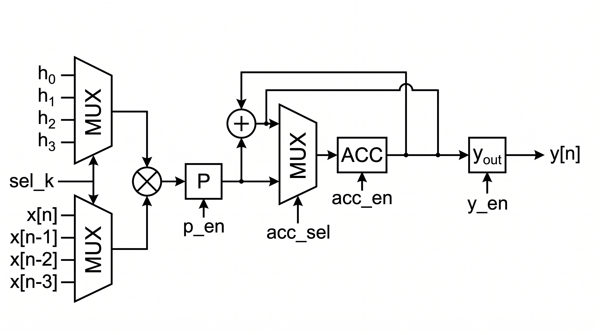
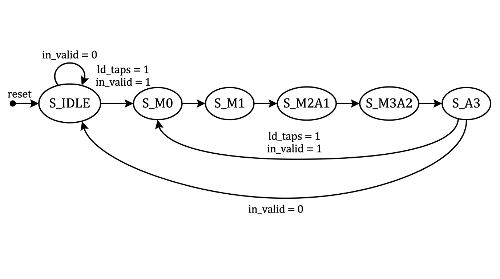

# Ejercicio 3 — Versión iterativa: FIR con recursos compartidos (folding)

## Consigna

Reescribir el FIR de 4 coeficientes usando **1 solo multiplicador y 1 solo sumador compartidos**, diseñando la FSM de control que orquesta la reutilización y estimando teóricamente la **latencia** y el **throughput** de la nueva arquitectura.

## Punto de partida

Tomamos como base los dos ejercicios anteriores:

* El [DFG del FIR directo](../ej1_DFG/README.md): 4 multiplicadores $M_0 \dots M_3$, la cadena de sumadores $A_1, A_2, A_3$ y la línea de retardo de 3 registros.
* El [scheduling ASAP/ALAP](../ej2_ASAP-ALAP/README.md): la versión directa necesita 4 ciclos por muestra con los 7 operadores trabajando (casi todos solo en el primer ciclo), y el análisis de movilidad nos dejó una observación clave: $M_2$ y $M_3$ tienen holgura, así que **no hacen falta 4 multiplicadores al mismo tiempo**.

Esa holgura es exactamente lo que explota este ejercicio: en vez de un operador por nodo del DFG, tenemos **dos recursos físicos** (un $\times$ y un $+$) que van ejecutando los 7 nodos en distintos ciclos, guiados por una FSM. Es el clásico *folding* por compartición de recursos: intercambiamos área por ciclos.

## ¿Qué significa "versión iterativa"?

La idea es separar el **qué** se calcula del **cuándo** se calcula. El DFG define las dependencias (qué operación necesita qué datos), pero no dice cuántas unidades de hardware existen. Si asignamos varios nodos del grafo a un mismo operador físico, ese operador los ejecuta en ciclos consecutivos y la FSM se encarga de:

1. **Enrutar los operandos**: muxes que conectan al recurso compartido el dato correcto en cada ciclo.
2. **Guardar resultados intermedios**: registros (producto parcial, acumulador) que retienen valores entre ciclo y ciclo.
3. **Secuenciar**: una FSM de control que recorre el scheduling ciclo a ciclo.

## Resolución

### 1. Scheduling con recursos {1 $\times$, 1 +}

Con un solo multiplicador, las 4 multiplicaciones ya no pueden ser paralelas: se escalonan en los ciclos 1 a 4. La cadena de sumadores se apoya en la movilidad que vimos en ALAP: $A_1$ no puede arrancar antes del ciclo 3 (necesita $M_0$ y $M_1$), y a partir de ahí cada suma coincide con una multiplicación que no tiene dependencia con ella. El resultado es un scheduling de **5 ciclos por muestra**, con dos registros de estado en el datapath: $P$ (producto) y $acc$ (acumulador).

| Ciclo | Multiplicador | Sumador | Escrituras |
| :---: | :--- | :--- | :--- |
| 1 | $M_0 = x_0 h_0$ | — | $P \leftarrow M_0$ |
| 2 | $M_1 = x_1 h_1$ | — | $P \leftarrow M_1$, $\;acc \leftarrow P\;(=M_0)$ |
| 3 | $M_2 = x_2 h_2$ | $A_1 = M_0 + M_1$ | $P \leftarrow M_2$, $\;acc \leftarrow A_1$ |
| 4 | $M_3 = x_3 h_3$ | $A_2 = A_1 + M_2$ | $P \leftarrow M_3$, $\;acc \leftarrow A_2$ |
| 5 | — | $A_3 = A_2 + M_3 = y$ | $y_{out} \leftarrow A_3$ |

> El detalle está en el ciclo 2: mientras el multiplicador calcula $M_1$ (que va a $P$), el valor viejo de $P$ ($M_0$) se copia a $acc$. Desde el ciclo 3 en adelante el sumador trabaja **siempre con el mismo par de operandos** $(acc, P)$, así que no hacen falta muxes adicionales en sus entradas.

### 2. ¿Por qué 5 ciclos es el mínimo posible?

Es la **cota inferior** con estos recursos:

* El multiplicador tiene que hacer 4 productos $\Rightarrow$ al menos **4 ciclos**.
* $A_1$ necesita $M_0$ y $M_1$ juntos; con un solo multiplicador, $M_1$ termina como muy temprano al **final del ciclo 2** $\Rightarrow$ $A_1 \geq$ ciclo 3, $A_2 \geq$ ciclo 4 y $A_3 \geq$ ciclo 5.

La cota inferior es 5 y nuestro scheduling la alcanza, así que es **óptimo** dado el hardware disponible. Vale la pena comparar contra las dos variantes extremas:

| Implementación | Recursos | Ciclos/muestra | Throughput relativo |
| :--- | :---: | :---: | :---: |
| Forma directa (ASAP, ej. 2) | 4 $\times$ + 3 $+$ | 4 | 1.00 |
| **Iterativa (esta)** | **1 $\times$ + 1 $+$** | **5** | **0.80** |
| Secuencial total (un recurso por vez) | 1 $\times$ + 1 $+$ | 7 | 0.57 |

> Dejando las multiplicaciones y sumas en paralelo cuando las dependencias lo permiten (gracias a la movilidad de ALAP) recuperamos 2 de los 7 ciclos, sin agregar ni un operador extra. Con un área que baja de 7 operadores a 2 (menos de un tercio), el throughput solo cae un 20% respecto de la forma directa: ese es el trade-off.

### 3. Arquitectura (RTL)

El datapath queda armado así:

* **Línea de retardo de 4 taps** ($x_0 \dots x_3$): se desplaza **una vez por muestra** (no una por ciclo) cuando la FSM acepta una entrada nueva. $x_0$ es la muestra actual y $x_3$ la de hace 3 muestras.
* **Dos mux 4:1** comandados por la señal `sel_k`: eligen qué tap y qué coeficiente alimentan al multiplicador en cada ciclo ($k = 0 \dots 3$).
* **Multiplicador compartido + registro de producto $P$**: $P$ se carga en los ciclos 1 a 4 (`p_en`) y retiene $M_3$ durante el ciclo 5, cuando el sumador todavía lo necesita.
* **Sumador compartido**: suma $acc + P$ (con $P$ extendido a ceros).
* **Acumulador $acc$** con mux 2:1 (`acc_sel`): en el ciclo 2 captura $P$ directo (guarda $M_0$) y en los ciclos 3 a 5 carga el resultado del sumador.
* **Registro de salida `y_out`**: copia el resultado al cerrar el ciclo 5 y lo mantiene estable 5 ciclos, desacoplando al consumidor del datapath.

**Anchuras**: con muestras y coeficientes de 8 bits sin signo ($W_X = W_H = 8$), cada producto ocupa 16 bits y la suma de los 4 productos como máximo vale $4 \cdot 255 \cdot 255 = 260100 < 2^{18} = 262144$, así que el acumulador y la salida usan $W_Y = W_X + W_H + 2 = 18$ bits, justo lo necesario para que no haya overflow.

**Interfaces**: el módulo expone un handshake.

* `in_ready` vale 1 solo cuando se puede aceptar una muestra (estando en `S_IDLE` o saliendo de `S_A3`); si el flujo de entrada insiste durante el cómputo, esa muestra se pierde.
* La salida avisa con `out_valid`, un pulso de 1 ciclo por muestra.

### 4. FSM de control

La FSM tiene **6 estados** (codificación binaria en 3 bits), uno por estado de espera más cada ciclo del scheduling. Es una máquina Moore donde la única señal externa que decide transiciones es `in_valid` (las demás salidas son decodificación pura del estado):

| Estado | Micro-operaciones (Moore) | Transición |
| :--- | :--- | :--- |
| `S_IDLE` | nada | si `in_valid`: acepta muestra (`ld_taps`) → `S_M0` |
| `S_M0` | $P \leftarrow x_0 h_0$ | → `S_M1` |
| `S_M1` | $P \leftarrow x_1 h_1; \quad acc \leftarrow P$ | → `S_M2A1` |
| `S_M2A1` | $P \leftarrow x_2 h_2; \quad acc \leftarrow acc + P$ | → `S_M3A2` |
| `S_M3A2` | $P \leftarrow x_3 h_3; \quad acc \leftarrow acc + P$ | → `S_A3` |
| `S_A3` | $y_{out} \leftarrow acc + P$ | si `in_valid`: acepta la próxima muestra y vuelve directo a `S_M0` (*back-to-back*); si no, → `S_IDLE` |

#### **Tabla de transiciones** (estado actual → siguiente estado, con las salidas que provoca)

| Estado actual | Condición | Siguiente estado | Outputs que provoca |
| :--- | :--- | :--- | :--- |
| `S_IDLE` | `in_valid = 1` | `S_M0` | `ld_taps=1`, `in_ready=1`; `sel_k=3`(NC), `p_en=0`, `acc_en=0`, `acc_sel=0`, `y_en=0` |
| `S_IDLE` | `in_valid = 0` | `S_IDLE` | `in_ready=1`, `ld_taps=0`; resto en 0 |
| `S_M0` | siempre | `S_M1` | `sel_k=0`, `p_en=1`; `in_ready=0`, `acc_en=0`, `acc_sel=0`, `y_en=0`, `ld_taps=0` |
| `S_M1` | siempre | `S_M2A1` | `sel_k=1`, `p_en=1`, `acc_en=1`, `acc_sel=0`; `in_ready=0`, `y_en=0`, `ld_taps=0` |
| `S_M2A1` | siempre | `S_M3A2` | `sel_k=2`, `p_en=1`, `acc_en=1`, `acc_sel=1`; `in_ready=0`, `y_en=0`, `ld_taps=0` |
| `S_M3A2` | siempre | `S_A3` | `sel_k=3`, `p_en=1`, `acc_en=1`, `acc_sel=1`; `in_ready=0`, `y_en=0`, `ld_taps=0` |
| `S_A3` | `in_valid = 1` | `S_M0` | `ld_taps=1`, `in_ready=1`, `y_en=1`, `acc_en=1`, `acc_sel=1`; `p_en=0`, `sel_k=3`(NC) (*back-to-back*) |
| `S_A3` | `in_valid = 0` | `S_IDLE` | `in_ready=1`, `y_en=1`, `acc_en=1`, `acc_sel=1`; `p_en=0`, `ld_taps=0`, `sel_k=3`(NC) |

#### **Salidas por estado** (Moore; solo `ld_taps` es Mealy y depende de `in_valid` en `S_IDLE` y `S_A3`)

| Estado | `sel_k` | `p_en` | `acc_en` | `acc_sel` | `y_en` | `in_ready` | `ld_taps` |
| :--- | :---: | :---: | :---: | :---: | :---: | :---: | :---: |
| `S_IDLE` | 3 (NC) | 0 | 0 | 0 | 0 | 1 | si `in_valid` |
| `S_M0` | 0 | 1 | 0 | 0 | 0 | 0 | 0 |
| `S_M1` | 1 | 1 | 1 | 0 | 0 | 0 | 0 |
| `S_M2A1` | 2 | 1 | 1 | 1 | 0 | 0 | 0 |
| `S_M3A2` | 3 | 1 | 1 | 1 | 0 | 0 | 0 |
| `S_A3` | 3 (NC) | 0 | 1 | 1 | 1 | 1 | si `in_valid` |

> (NC) = don't-care: el valor aparece fijado en la decodificación pero no afecta porque `p_en=0` no carga el producto.*

Dos detalles de diseño que conviene destacar:

* **Streaming sin ciclos muertos**: la transición `S_A3 → S_M0` permite aceptar la muestra siguiente en el mismo flanco en que se registra el resultado de la actual. Eso es lo que hace que el período efectivo sea de 5 ciclos y no 6 o 7.
* **Un solo punto Mealy**: `ld_taps` depende de `in_valid` en `S_IDLE` y `S_A3`; todo lo demás es Moore, lo que mantiene la FSM simple de verificar.

En el código la máquina vive en su propio módulo (`fir4_ctrl`) separado del datapath (`fir4_datapath`), con la frontera clásica control/datapath:

* la FSM genera `sel_k`, `p_en`, `acc_sel`, `acc_en`, `y_en` y `ld_taps`
* el datapath le devuelve el estado de ocupación a través de `in_ready`.

### 5. Estimación teórica de latencia y throughput

#### **Latencia**

Son los ciclos entre el ciclo en que `in_valid` está alto y el ciclo en que `out_valid` se ve alto:

$$\underbrace{1}_{\text{captura en IDLE}} + \underbrace{5}_{\text{cómputo (S\_M0..S\_A3)}} + \underbrace{0}_{\text{salida registrada al cierre}} = 6 \text{ ciclos}$$

Es decir: la muestra se captura en el flanco que cierra el ciclo de `in_valid`, pasa 5 ciclos de cómputo ($S\_M0 \rightarrow S\_A3$) y el resultado queda registrado en el flanco que cierra $S\_A3$, visible al ciclo siguiente. Si en cambio contamos desde la aceptación hasta el registro del resultado, el camino del dato son 5 ciclos.

#### **Throughput**

Son las muestras por ciclo, modo streaming con `in_valid` permanente: la aceptación de la muestra $n+1$ coincide con el flanco en que se registra la salida de la muestra $n$ (transición `S_A3 → S_M0`), así que el período de iniciación, conocido como **II o initiation interval**, es de 5 ciclos. Por lo tanto:

$$Th = \frac{1}{II} = \frac{1}{5} = 0{,}2 \; \text{muestras/ciclo} \quad\Rightarrow\quad Th = \frac{f_{clk}}{5} \; \text{muestras/s}$$

Con $f_{clk} = 100\,\text{MHz}$, por ejemplo, serían 20 millones de muestras por segundo.

#### Utilización de los recursos (de qué ciclos disponibles se aprovechan)

| Recurso | Ciclos activos | Utilización |
| :--- | :---: | :---: |
| Multiplicador | 4 de 5 (ciclos 1-4) | 80% |
| Sumador (sumas útiles) | 3 de 5 (ciclos 3-5) | 60% |

El multiplicador es el recurso cuello de botella: de los 5 ciclos trabaja en 4, y la cota del punto 2 muestra que no hay forma de hacerlo trabajar más. El sumador tiene margen ocioso que en una versión con más taps se podría explotar con más holgura de scheduling.

#### **Resumen de la estimación** (todo esto es lo que el testbench verifica después)

| Métrica | Valor teórico |
| :--- | :---: |
| Latencia ($in\_valid \rightarrow out\_valid$) | 6 ciclos |
| II / período en streaming | 5 ciclos |
| Throughput | $f_{clk}/5$ muestras/s |

### 6. Verificación

El testbench (`tb_fir4.sv`) es *self-checking*: replica el filtro en un modelo de referencia (que solo actualiza su historia de taps cuando el DUT realmente acepta una muestra, respetando el handshake) y compara cada salida contra una cola de valores esperados. Las fases son:

1. **Respuesta al impulso**: con $h = (1,2,3,4)$ y $x = (8,0,0,0,0,0)$ la salida tiene que ser $8, 16, 24, 32, 0, 0$. Es la prueba estructural: si un tap quedara cruzado con el coeficiente equivocado, no da esa secuencia.
2. **Borde de ancho**: con $h = x = 255$ el pico es $4 \cdot 255 \cdot 255 = 260100$, que entra justo en los 18 bits del acumulador; si el ancho estuviera mal elegido, acá se desborda.
3. **Streaming back-to-back**: 100 muestras con `in_valid` permanente; se mide el período entre salidas consecutivas y la cantidad de ciclos útiles de cada recurso.
4. **Gaps aleatorios**: 300 intentos con `in_valid` sorteado (~35%) y datos aleatorios, para estresar el handshake (muestras que llegan durante el cómputo y no se aceptan).
5. **Latencia aislada**: 3 transacciones separadas para medir la latencia sin el modo streaming.

Y como cierre, `run.sh` verifica con **Yosys** la premisa central del ejercicio sobre el netlist real: que existan **exactamente 1 multiplicador** (`$mul`), **1 sumador** (`$add`) y **88 bits de registro** (32 de la línea de retardo + 16 de $P$ + 18 de $acc$ + 18 de `y_out` + 3 de estado + 1 de `out_valid`).

## Conclusiones

* El scheduling con recursos $\{1\times, 1+\}$ necesita **5 ciclos por muestra**, y demostramos que es la cota inferior: el multiplicador (4 productos) más la serialización forzada de $M_0$ y $M_1$ no dejan margen para nada más corto.
* La **latencia** resultante es de 6 ciclos (5 de cómputo + el registro de salida) y el **throughput** en streaming es $f_{clk}/5$, gracias a la transición de *back-to-back* que acepta una muestra nueva mientras se registra el resultado de la anterior.
* El área baja de 7 operadores a 2 (menos del 30%) a cambio de un throughput un 20% menor que la forma directa: el multiplexado y los registros intermedios son el "peaje" del folding.
* La separación control/datapath deja la FSM con 6 estados triviales de verificar y un datapath sin muxes extra en las entradas del sumador, gracias al truco de capturar $M_0$ en el acumulador en el ciclo 2.
* Este módulo es el punto de partida natural del Ejercicio 4: ahora el camino crítico es de **un solo operador por ciclo**, así que el pipelining con *cut-set* apuntará a recuperar frecuencia de reloj, y el Ejercicio 5 va a poner lado a lado las métricas PPA de ambas versiones.
