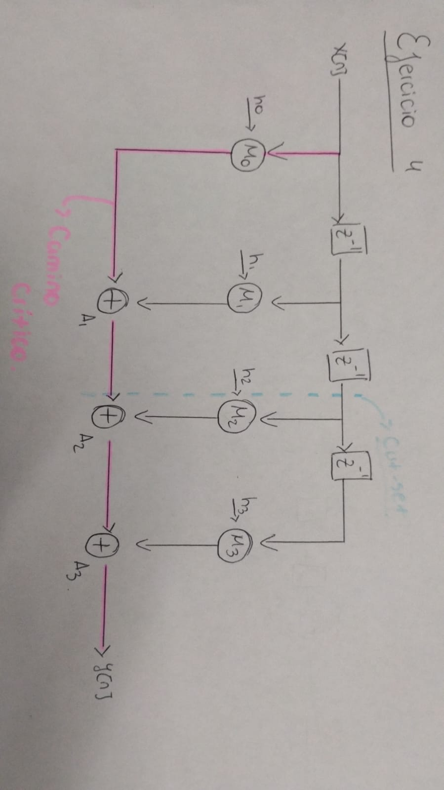
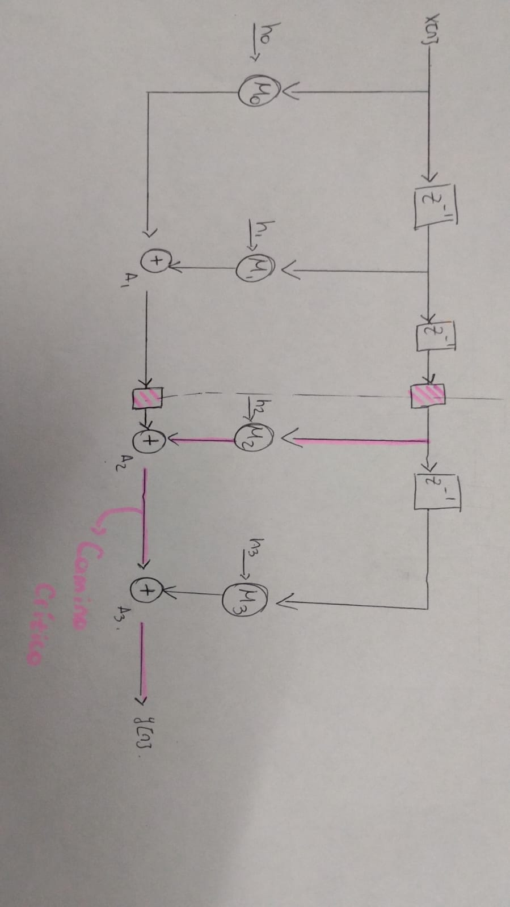

# Ejercicio 4 — Inserción de pipeline mediante feed-forward cut-set

## Enunciado

Aplicar un cut-set feed-forward para insertar 2 etapas de pipeline.

Calcular el nuevo camino crítico y comparar fmax.

### Feed-forward cut-set

Un *feed-forward cut-set* es un conjunto de aristas del grafo de flujo de datos (DFG) tal que, al eliminarlas, el grafo queda dividido en dos particiones disjuntas, y **todas** las aristas del corte apuntan en el mismo sentido (de una partición hacia la otra), sin que exista ninguna arista que vuelva hacia atrás. Es decir, el corte no atraviesa ningún ciclo de realimentación del grafo. No se modifica la función de transferencia

Para que el corte sea válido a los fines de retiming, además debe cumplirse la propiedad de *single crossing*: cada camino posible desde una entrada hasta una salida del sistema debe cruzar el conjunto de aristas cortadas **exactamente una vez**. Esto garantiza que, al insertar un registro en cada arista del corte, se agrega la misma cantidad de latencia a todos los caminos por igual, preservando la funcionalidad combinacional original del circuito — solo se retrasa la salida en una cantidad fija de ciclos, sin alterar el resultado.

La regla de aplicación es directa: **insertar N registros idénticos, uno en cada arista de un feed-forward cut-set, agrega exactamente una etapa de pipeline por cada cut-set aplicado**. 

### Aplicación al filtro FIR de 4 taps

Sobre el DFG del filtro, se definieron dos cortes feed-forward para insertar **2 etapas de pipeline**:

- **Corte 1:** a la salida del segundo `z⁻¹`, antes de que la señal se bifurque hacia `M2` y hacia el tercer `z⁻¹`. Al aprovechar que ambas ramas comparten el mismo nodo fuente, se implementa con un único registro compartido.
- **Corte 2:** en la arista que va de `A1` a `A2`.


## Cálculo del camino crítico teórico y comparación de Fmax

Se toman los tiempos de propagación: `Tm = 2` u.t. (multiplicador), `Ta = 1` u.t. (sumador).

### Versión sin pipeline 




El camino crítico combinacional es el que atraviesa un multiplicador y los tres sumadores de la cadena:

```
Tcrit = Tm + 3·Ta = 2 + 3 = 5 u.t.
Fmax  = 1 / 5
```

### Versión con pipeline 



Tras insertar los 2 registros del cut-set, el circuito queda dividido en dos etapas combinacionales:

- **Etapa 1:** `M0`/`M1` + `A1` → `Tm + Ta = 2 + 1 = 3` u.t.
- **Etapa 2:** `M2` + `A2` + `A3` → `Tm + 2·Ta = 2 + 2 = 4` u.t.

El camino crítico global es el máximo entre las etapas:

```
Tcrit = max(3, 4) = Tm + 2·Ta = 4 u.t.
Fmax  = 1 / 4
```

### Comparación

| Versión | Camino crítico | Fmax |
|---|---|---|
| Sin pipeline | Tm + 3·Ta = 5 u.t. | 1/5 |
| Con pipeline (2 etapas) | Tm + 2·Ta = 4 u.t. | 1/4 |

La inserción del cut-set feed-forward mejora Fmax de 1/5 a 1/4, ya que se reduce en una unidad de sumador el camino crítico dominante. Un pipeline transversal, que separe los multiplicadores de los sumadores, permitiría bajar aún más el camino crítico, a costa de agregar más registros (mayor área).