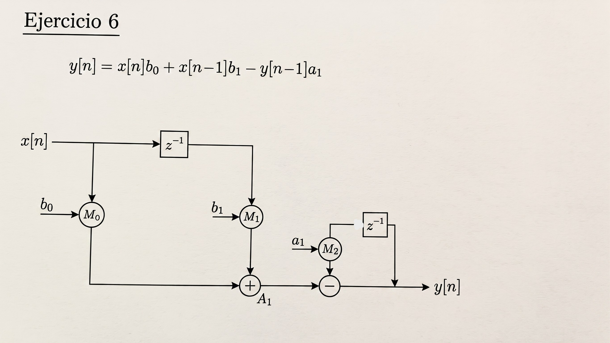

# Ejercicio 6 — Identificar IPB

## Enunciado

Identificar IPB. Convertir el FIR a un IIR de 1er orden y calcular IPB. Discutir cómo bajarlo con Shannon o C-Slow.

---

## 1. FIR vs IIR: la diferencia clave

El filtro de partida es un **FIR** (Finite Impulse Response), implementado en forma directa con 4 coeficientes:

$$y[n] = h_0x[n] + h_1x[n-1] + h_2x[n-2] + h_3x[n-3]$$

Es una estructura puramente **feedforward**: la salida depende solo de entradas presentes y pasadas, nunca de salidas anteriores. Al no tener ningún camino que "vuelva sobre sí mismo", no tiene lazos (loops) en el grafico de flujo (DFG).

Un **IIR** (Infinite Impulse Response), en cambio, es un filtro que tiene **realimentación**: la salida actual depende de valores de salida pasados. Eso es justamente lo que agrega un **lazo cerrado** al DFG, y es la diferencia estructural que hace que aparezcan restricciones de velocidad que un FIR no tiene.

### Conversión a IIR de 1er orden

$$y[n] = b_0\,x[n] + b_1\,x[n-1] - a_1\,y[n-1]$$

Esta ecuación tiene dos partes bien diferenciadas:

- **Parte feedforward**: $b_0x[n] + b_1x[n-1]$ — no depende del lazo, se puede calcular en paralelo.
- **Parte recursiva**: $-a_1y[n-1]$ — cierra un lazo de realimentación con un único registro.

---

## 2. Límite de lazo (Li) e Iteration Period Bound (IPB)

### ¿Qué es el Li?

El **Li** (límite de lazo) es, para un lazo cerrado puntual del DFG, cuánto tiempo mínimo necesita ese lazo para completar una vuelta completa, medido *por cada registro que tiene disponible para repartir ese trabajo*. Se calcula como:

$$L_i = \frac{\text{suma de los tiempos de cómputo de los nodos del lazo}}{\text{cantidad de registros (retardos) del lazo}}$$

En nuestro IIR de 1er orden, el lazo de realimentación tiene:
- Cómputo: 1 multiplicación ($\times a_1$) + 1 suma
- Registros: 1 (el de $y[n-1]$)

$$L_i = \frac{t_{mult} + t_{add}}{1} = t_{mult}+t_{add}$$

### ¿Qué es el IPB?

El **IPB** (Iteration Period Bound) es simplemente el **peor caso**: el valor más alto de $L_i$ entre *todos* los lazos que existen en el DFG completo.

$$IPB = \max_i (L_i)$$

Esto tiene sentido porque el reloj del sistema tiene que ser lo suficientemente lento como para que **el lazo más exigente** llegue a completarse en un ciclo — no alcanza con que la mayoría de los lazos estén cómodos si hay uno solo que no da los tiempos. El IPB es, entonces, el período de reloj mínimo teórico impuesto por la estructura recursiva del sistema, y define la máxima frecuencia de reloj ($F_{max} = 1/IPB$) y el máximo throughput alcanzables sin cambiar la arquitectura.

**En el IIR de 1er orden**: aparece un lazo real, y por lo tanto un IPB $= t_{mult}+t_{add} > 0$.

---

## 3. Cómo bajar el IPB

### Opción A: Shannon

El **teorema de Shannon** (descomposición de Shannon) indica que cualquier función se puede descomponer en torno a una de sus variables, obteniendo dos nuevas funciones — una asumiendo que esa variable vale 0 y otra asumiendo que vale 1 — que luego se seleccionan mediante un **MUX** según el valor real que tome esa variable:

$$f = \bar{x}\cdot f|_{x=0} + x\cdot f|_{x=1}$$

La ventaja práctica es que ambas ramas ($f|_{x=0}$ y $f|_{x=1}$) se pueden **precalcular en paralelo, sin esperar** a que la variable $x$ esté disponible. Cuando $x$ finalmente llega, el MUX resuelve en un solo paso lo que de otra forma exigiría calcular la función completa desde cero — sacando ese cómputo del camino crítico.

Esto funciona naturalmente en **álgebra booleana**, porque una variable booleana solo tiene 2 valores posibles (0 y 1), así que con un MUX de 2 entradas alcanza para cubrir todos los casos.

En principio, la idea se podría **extrapolar a álgebra lineal** (reemplazando la variable booleana por una variable numérica, como $y[n-1]$ en nuestro lazo). El problema es que $y[n-1]$ no tiene solo 2 valores posibles. Para aplicar Shannon "literal" sobre $y[n-1]$ habría que precalcular una rama por **cada uno** de sus valores posibles, lo que implicaría un MUX con una cantidad de entradas igual a la cantidad de valores que puede tomar $y[n-1]$ — algo engorroso en la práctica.

### Opción B: C-Slow

**C-slow** es una técnica que consiste en agregar $C$ registros en cascada en lugar de cada registro que ya existe en el DFG (tanto en los caminos feedforward como en el lazo de realimentación), con el objetivo de aumentar $F_{max}$ y el throughput, a costa de aumentar la latencia total y el área utilizada del circuito.

Esta técnica afecta principalmente a los **lazos realimentados**, porque es justamente ahí donde está la fórmula del límite de lazo:

$$L_i = \frac{\text{suma de tiempos de cómputo del lazo}}{\text{registros del lazo}}$$

Al reemplazar el único registro del lazo por $C$ registros, el **denominador crece en un factor $C$**, lo que reduce directamente el $L_i$ de ese lazo:

$$L_i^{(C\text{-slow})} = \frac{t_{mult}+t_{add}}{C}$$

Como el IPB es el mayor $L_i$ de todo el circuito, reducir el $L_i$ del lazo más restrictivo reduce también el **IPB global**. Y como $F_{max} = 1/IPB$, bajar el IPB permite subir la frecuencia máxima de reloj y, con ella, el throughput del sistema.

El costo de esta mejora es que ahora el circuito tiene $C$ veces más registros, mayor latencia (la salida tarda más ciclos en aparecer) y mayor área — además de que, para aprovechar el paralelismo que se abre, hace falta contar con $C$ streams de datos independientes intercalados (o replicar el mismo stream en un esquema de interleaving).
